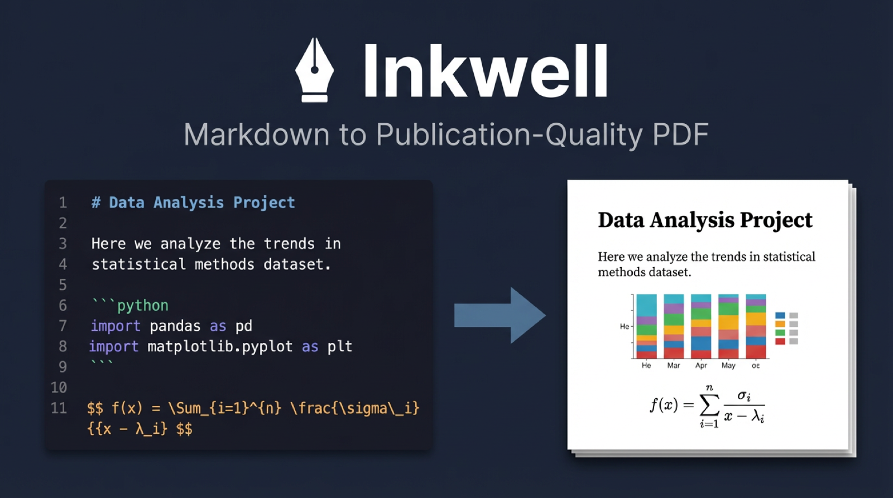
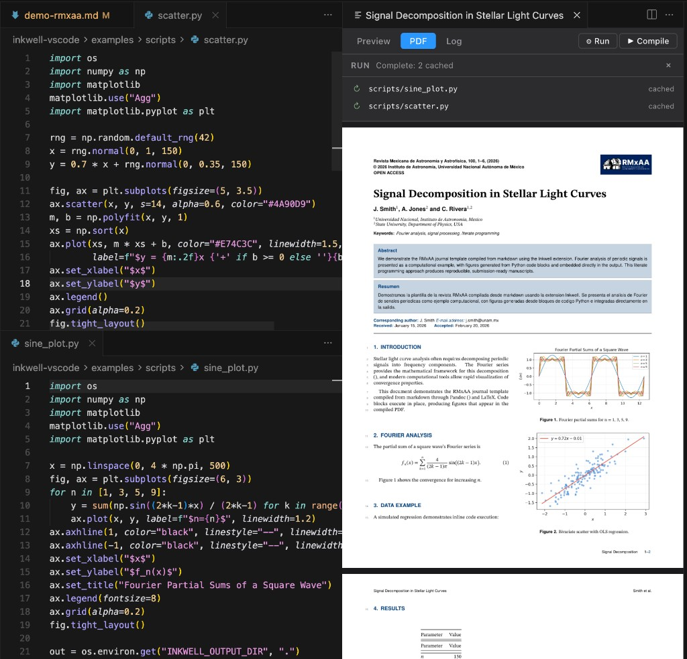
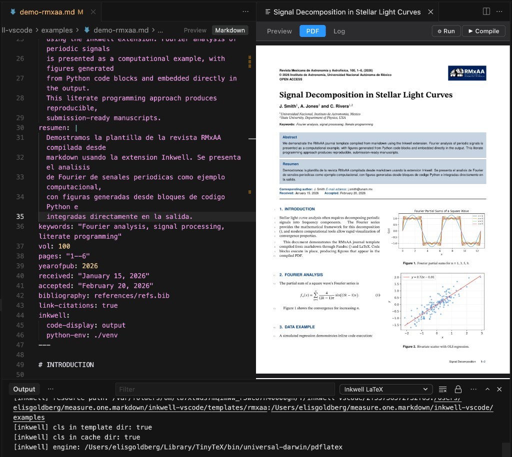
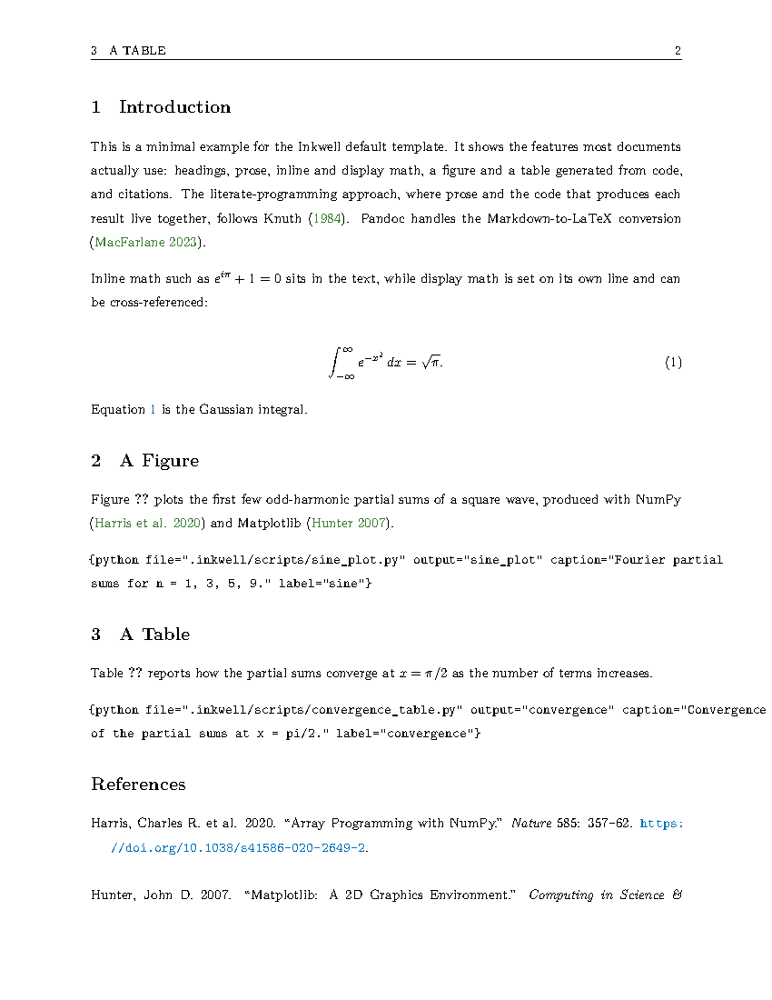
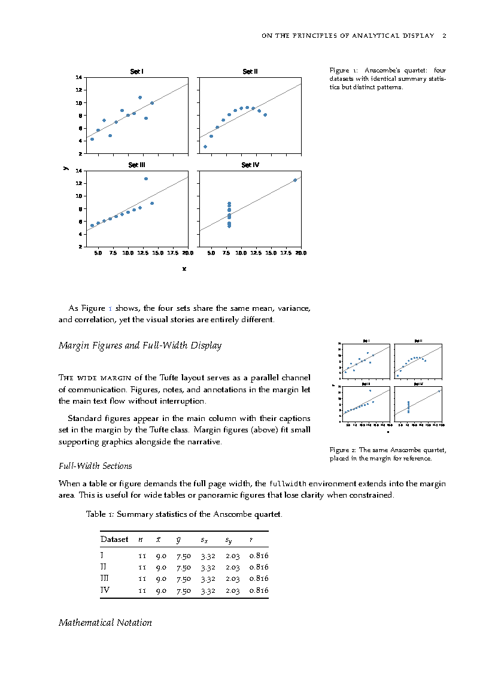
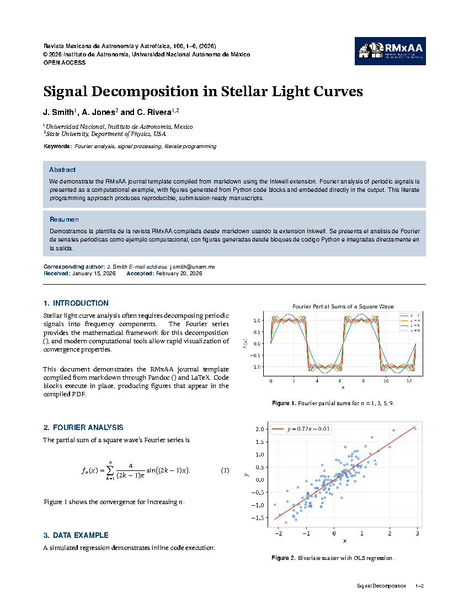
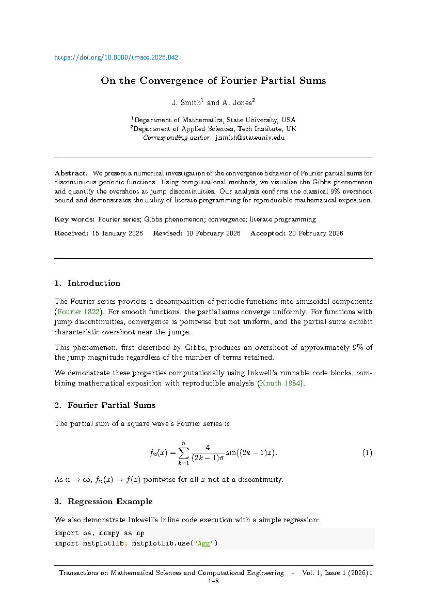
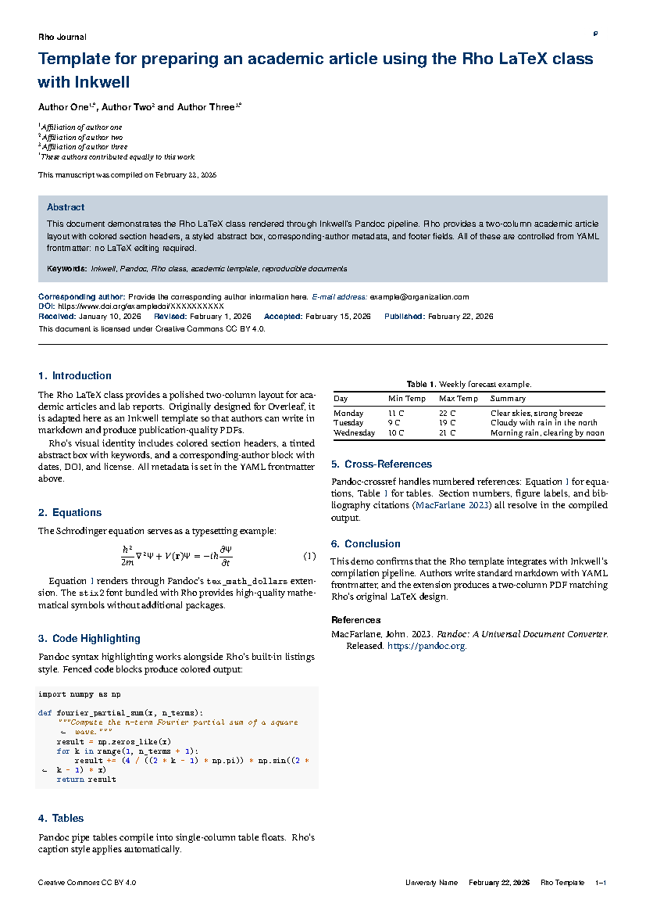
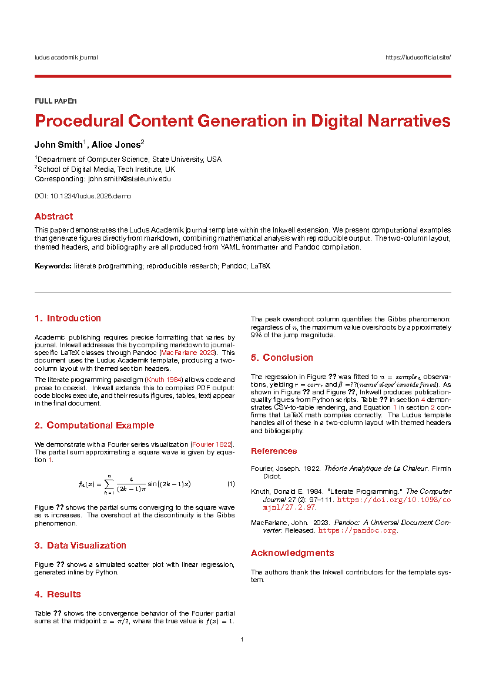

# Inkwell



Inkwell lets you stay in markdown, stay in your editor, and still get publication-quality PDFs out the other end. Your analysis scripts run in place, their outputs land in the document, and the whole thing compiles to LaTeX without you ever opening a `.tex` file. Or open one. It handles those too.

## How it works

1. **Write** in markdown with YAML frontmatter for metadata and styling
2. **Run** code blocks (Python, R, Shell, Node) that produce figures, tables, and text
3. **Compile** through Pandoc and LaTeX (XeLaTeX or pdfLaTeX, per template) with your chosen journal template
4. **PDF** output with embedded results, citations, and formatted math





## Installation

### 1. Install the extension

**Option A: Install a pre-built .vsix** (recommended)

Download the latest `.vsix` from [Releases](https://github.com/goldberg-consulting/measured.one.inkwell-extension/releases), then:

```bash
cursor --install-extension inkwell-0.1.6.vsix --force
# or: code --install-extension inkwell-0.1.6.vsix --force
```

Or in the editor: `Cmd+Shift+P` > **Extensions: Install from VSIX...** and select the file.

**Verify a `.vsix` install (recommended):** `Cmd+Shift+P` > **Developer: Reload Window**. Then run **Inkwell: Check / Install Toolchain**, open a markdown file with `{mermaid}` blocks (e.g. `examples/demo-default.md`), run **Inkwell: Compile PDF**, and confirm `.inkwell/mermaid/` contains rendered images and the PDF shows diagrams—not raw mermaid source as code listings. That matches what end users get (a bundled extension with no dev-folder fallback).

**Option B: Build from source**

```bash
git clone https://github.com/goldberg-consulting/measured.one.inkwell-extension.git
cd measured.one.inkwell-extension
npm install
npm run compile
```

Then either:

- **Install from folder** (development): `Cmd+Shift+P` > **Developer: Install Extension from Location...** > select the repo folder > reload the window.
- **Package as .vsix**: `npm run package && npx @vscode/vsce package` > install the resulting `.vsix` as above. (`vscode:prepublish` runs `package` before publish, but run it locally too before `vsce package` so `out/extension.js` includes the latest bundle.)

### 2. Install the toolchain (Pandoc + LaTeX)

After the extension is active, run `Cmd+Shift+P` → **Inkwell: Check / Install Toolchain**. The guided installer detects what you have and walks you through installing the rest, including the full LaTeX package set from `requirements-latex.txt`.

Or install manually:

**macOS (Homebrew + MacTeX — full install):**

```bash
brew install pandoc pandoc-crossref
brew install --cask mactex
npm install -g @mermaid-js/mermaid-cli
```

That gives you everything: Pandoc, cross-reference filters, LaTeX (XeLaTeX + pdfLaTeX), and Mermaid diagram support.

**macOS (Homebrew + TinyTeX — ~150 MB instead of ~5 GB):**

```bash
brew install pandoc pandoc-crossref
curl -sL "https://yihui.org/tinytex/install-bin-unix.sh" | sh
npm install -g @mermaid-js/mermaid-cli
```

Then install the LaTeX packages Inkwell's templates need (listed in [`requirements-latex.txt`](requirements-latex.txt)):

```bash
tlmgr update --self
sed 's/#.*//' requirements-latex.txt | awk 'NF' | xargs tlmgr install
texhash || mktexlsr
```

**Linux:**

```bash
sudo apt install pandoc texlive-full                 # Debian/Ubuntu
sudo dnf install pandoc texlive-scheme-full          # Fedora
npm install -g @mermaid-js/mermaid-cli
```

`pandoc-crossref` is required for `@fig:`, `@eq:`, and `@tbl:` cross-references. On Linux, install from [GitHub releases](https://github.com/lierdakil/pandoc-crossref/releases) or your package manager if available (`sudo apt install pandoc-crossref`).

If `tlmgr` is available on your Linux TeX install, run the same full requirements pass:

```bash
sudo tlmgr update --self
sed 's/#.*//' requirements-latex.txt | awk 'NF' | xargs sudo tlmgr install
sudo texhash || sudo mktexlsr
```

**Python** (optional, for runnable `{python}` code blocks): set up per-project with `Cmd+Shift+P` > **Inkwell: Setup Python Environment**, or manually:

```bash
python3 -m venv venv && source venv/bin/activate && pip install -r requirements.txt
```

**Troubleshooting**

- **Missing LaTeX packages:** If compilation fails with `Missing file: foo.sty`, run `tlmgr install foo`. The build log (`Cmd+Shift+U` > **Inkwell LaTeX**) shows the exact missing filename.
- **Mermaid in PDF:** Diagram blocks need `mmdc` from `@mermaid-js/mermaid-cli` (e.g. `npm install -g @mermaid-js/mermaid-cli`). Without it, live preview may still show something useful, but **compiled PDFs** often leave mermaid as code listings and **`.inkwell/mermaid/`** stays empty.
- **Cursor/VS Code launched from the Dock (Node managers):** GUI apps do not inherit your shell `PATH`. Inkwell augments `PATH` for subprocesses (Mermaid, Pandoc/TeX) with **`~/.npm-global/bin`**, **`nvm`** (`NVM_BIN`, **`~/.nvm/alias/default`**, and every **`~/.nvm/versions/node/<version>/bin`**), **`fnm`** (`FNM_MULTISHELL_PATH`), and **Volta** (`VOLTA_HOME` or **`~/.volta/bin`**). If `mmdc` is still missing, it runs a one-time **`SHELL -ilc`** resolution and prepends that directory for the session. Check **View → Output → Inkwell LaTeX** for a PATH diagnostic if **`mmdc --version`** fails. You can still install **`mmdc`** via **Homebrew** or symlink it into **`/opt/homebrew/bin`** if you prefer.

### 3. Bootstrap your workspace

For a **new project**: `Cmd+Shift+P` > **Inkwell: New Project** — scaffolds a complete project with starter document, scripts, bibliography, example files, and a syntax guide, all organized under `.inkwell/`.

For an **existing repo**: `Cmd+Shift+P` > **Inkwell: Bootstrap Workspace (.inkwell Folder)** — adds a `.inkwell/` directory with the standard subdirectory structure, manifest, templates, and guide without touching your existing files.

See the **[Syntax Guide](guide.md)** for the complete reference on YAML frontmatter, code blocks, math, citations, and template-specific fields.

## Quick start

1. `Cmd+Shift+P` > **Inkwell: New Project**
2. Select a folder for your project
3. Name your document (this becomes the main `.md` filename)
4. Pick a template (Default, Tufte, Rho, TMSCE, Ludus, RMxAA, or KTH Letter)
5. Choose whether to set up a Python virtual environment (recommended if your document will have code blocks)
6. Inkwell creates the project with starter files, example scripts, bibliography, and a syntax guide at `.inkwell/guide.md`
7. Write your markdown in the generated `.md` file
8. `Cmd+Shift+B` to **Run** code blocks
9. `Cmd+Shift+R` to **Compile** to PDF
10. `Cmd+Shift+V` to open the **Preview** panel (live HTML, compiled PDF, and build log)

## Project structure

Everything Inkwell manages lives under `.inkwell/`, keeping your working tree clean:

```
my-paper/
  my-paper.md              # your document
  requirements.txt         # Python dependencies (if enabled)
  venv/                    # Python environment (if enabled)
  .inkwell/
    manifest.json          # project config (template, settings)
    guide.md               # syntax reference
    scripts/               # analysis code (sine_plot.py, scatter.py, ...)
    figures/               # static images, diagrams
    references/            # .bib files
    examples/              # demo .md files for each template
    outputs/               # cached code block results (gitignored)
    mermaid/               # cached mermaid renders (gitignored)
    templates/             # project-local template overrides (optional)
  .gitignore
```

## Features

### Live preview

Side panel (`Cmd+Shift+V`) with three tabs:

- **Preview**: HTML rendering styled to match the PDF output. Supports KaTeX math, Mermaid diagrams, cross-references (`@fig:`, `@sec:`, `@tbl:`, `@eq:`), citation styling, title/abstract blocks, and frontmatter font overrides (`mainfont`, `monofont`). Updates as you type.
- **PDF**: compiled output rendered in-panel
- **Log**: compilation output, code block stderr, errors

### Compilation output

Detailed build logs are available in the **Output** panel (`Cmd+Shift+U`). Select **Inkwell LaTeX** from the dropdown in the top-right corner of the panel. This shows:

- Template and PDF engine used for each compilation
- Pass/fail status with elapsed time
- LaTeX errors and warnings with line numbers
- Missing package names (with quick-fix code actions in the editor)
- Full Pandoc and LaTeX log output for debugging

### Runnable code blocks

Embed scripts directly or reference external files. Python, R, Shell, Node.

````markdown
```{python file=".inkwell/scripts/analysis.py" output="results" caption="My figure" label="analysis"}
```

```{python display="both" output="scatter" caption="Scatter plot with regression."}
import numpy as np
# ... your code here ...
```

```{shell display="both"}
echo "Built on $(date)"
```
````

**Code block attributes:**

| Attribute | Description |
|-----------|-------------|
| `file`    | Run an external script instead of inline code |
| `output`  | Name for cached artifacts (figures, tables) |
| `display` | Visibility: `output`, `both`, `code`, `none` |
| `env`     | Point a specific block at a different venv |
| `caption` | Figure or table caption in the compiled PDF |
| `label`   | Cross-reference label (produces `fig:label` or `tbl:label`) |
| `cache`   | Set to `"false"` to re-run every time, skipping the content cache |

Results cache in `.inkwell/outputs/`. Only re-run when the code actually changes.

### Generated tables and figures

Code blocks that write files to `INKWELL_OUTPUT_DIR` automatically embed them in the PDF. The `output` attribute names the artifact, and the file extension determines how it renders:

- **Images** (`.png`, `.jpg`, `.svg`, `.pdf`, `.eps`) render as figures
- **CSV** files render as formatted tables with booktabs styling
- **JSON** arrays of objects render as tables
- **Markdown** (`.md`) and **LaTeX** (`.tex`) files are passed through raw

````markdown
```{python output="summary" caption="Descriptive statistics." label="stats"}
import os, numpy as np
out = os.environ.get("INKWELL_OUTPUT_DIR", ".")
with open(os.path.join(out, "summary.csv"), "w") as f:
    f.write("Variable,n,Mean,Std\n")
    f.write("x,150,-0.05,0.85\n")
    f.write("y,150,-0.05,0.71\n")
```
````

The `caption` and `label` attributes add a numbered caption and a cross-referenceable label (`@Tbl:stats` in this case).

### Inline data binding

Code blocks can export named values that you reference later in prose, captions, or table cells. This connects your computed results to your writing so the numbers stay in sync.

**Step 1: Export values from a code block** by printing `::inkwell key=value` lines. These lines are stripped from visible output:

```python
print(f"::inkwell sample_n={len(x)}")
print(f"::inkwell corr_r={r_val:.3f}")
print(f"::inkwell slope={m:.3f}")
```

**Step 2: Reference them in your markdown** using one of two syntaxes:

| Syntax | What it does | Example |
|--------|-------------|---------|
| `{{key}}` | Inserts the raw value as-is | `{{sample_n}}` becomes `150` |
| `` `{python} expr` `` | Evaluates a Python expression with all exported variables pre-loaded | `` `{python} f"{float(corr_r):.2f}"` `` becomes `0.87` |

Use `{{key}}` for values that need no formatting (counts, labels). Use `` `{python} expr` `` when you need to format, round, or compute: f-strings, arithmetic, conditionals, and function calls all work. Variables are loaded as strings, so cast with `float()` or `int()` as needed.

```markdown
The model was fitted to {{sample_n}} observations, yielding
$r = `{python} f"{float(corr_r):.2f}"`$ and
$\hat\beta = `{python} f"{float(slope):.1f}"`$.
```

Re-run the code blocks (`Cmd+Shift+B`) after adding or changing `::inkwell` exports so the variable store picks up the new values.

### Mermaid diagrams

Fenced mermaid blocks compile to figures with full cross-reference support. The preview panel renders them client-side via mermaid.js; PDF compilation uses `mmdc` (mermaid-cli) to produce high-resolution PNG images that Pandoc embeds directly in the LaTeX output.

````markdown
```{mermaid caption="System architecture" label="arch"}
graph LR
    A[Client] --> B[API Gateway]
    B --> C[Service]
    C --> D[Database]
```
````

Reference the diagram with `@Fig:arch` anywhere in the document. Plain ` ```mermaid ` blocks (without attributes) also render, but without captions or labels. All diagram types that `mmdc` supports work: flowcharts, sequence diagrams, ER diagrams, state diagrams, Gantt charts, and more.

Rendered artifacts are cached in `.inkwell/mermaid/` by content hash. A diagram only re-renders when its source changes.

**Requirements:** `npm install -g @mermaid-js/mermaid-cli` for PDF compilation. If `mmdc` is not installed, mermaid blocks pass through as code listings.

### Citations and bibliography

Add a `.bib` file and reference it in your frontmatter:

```yaml
bibliography: .inkwell/references/refs.bib
link-citations: true
```

Cite with standard Pandoc syntax: `[@knuth1984]`, `[@harris2020; @hunter2007]`. Inkwell runs `--citeproc` automatically. A formatted bibliography appears wherever you place a `## References` heading.

### Table of contents, list of figures, list of tables

```yaml
toc: true
lof: true
lot: true
```

### Python environments

Set `python-env: ./venv` in your frontmatter for the whole document, or `env="./other-venv"` on a single block. The **Setup Python Environment** command creates the venv and installs from `requirements.txt`.

### Formatting from frontmatter

Style the compiled output without editing LaTeX:

```yaml
inkwell:
  code-bg: "#f5f5f5"
  code-border: true
  code-font-size: small
  tables: booktabs
  table-font-size: small
  hanging-indent: true
  columns: 2
```

### Self-contained `.inkwell/` workspace

All extension-managed resources live under a single `.inkwell/` directory: scripts, figures, references, examples, cached outputs, mermaid renders, and templates. Your project root stays clean — just your `.md` document files, a `.gitignore`, and optionally a Python venv. The scaffold creates the full structure automatically via **New Project** or **Bootstrap Workspace**, and the **Update Project** command backfills any missing directories or starter files.

## Templates

Inkwell ships with eight templates. Each template includes a Pandoc `.latex` wrapper that compiles with the template's native document class. Templates declare their preferred PDF engine (`xelatex` or `pdflatex`) in `template.json`; Inkwell selects the right one automatically.

| Template | Class | Engine | Description |
|----------|-------|--------|-------------|
| **Inkwell Default** | `article` | xelatex | Clean article with theorem environments, code highlighting, title page |
| **Tufte Handout** | `tufte-handout` | pdflatex | Edward Tufte-inspired layout with wide margins, sidenotes, and margin figures |
| **Rho Academic** | `rho` | pdflatex | Two-column academic article with colored headers, abstract box, footer metadata |
| **TMSCE** | `tmsce` | pdflatex | Transactions on Mathematical Sciences and Computational Engineering |
| **Ludus Academik** | `ludusofficial` | xelatex | Ludus Academik Journal (themed, two-column) |
| **RMxAA** | `rmaa-rho` | pdflatex | Revista Mexicana de Astronomia y Astrofisica (v4.6, two-column) |
| **KTH Letter** | `kth-letter` | pdflatex | Official KTH (Royal Institute of Technology) letterhead |
| **ETH Report** | `standard` (KOMA) | pdflatex | ETH Zürich IVT working paper with title page, abstract, keywords |

Select a template with `template: tufte` in your YAML frontmatter, or use `Cmd+Shift+P` > **Inkwell: Select LaTeX Template**.

Journal-specific metadata (DOI, volume, issue, author affiliations, received/accepted dates) is set through YAML frontmatter. See the example files in [`examples/`](examples/) for complete working documents with each template. When you scaffold a project, these are copied to `.inkwell/examples/` for reference.

### Custom templates

You can add your own journal or house style by creating a template directory. Templates live in one of three locations, searched in this order:

| Location | Scope | Path |
|----------|-------|------|
| Built-in | Ships with Inkwell | `<extension>/templates/<name>/` |
| Global | All projects on this machine | `~/.inkwell/templates/<name>/` |
| Project-local | Single project only | `.inkwell/templates/<name>/` |

A global or project-local template with the same name as a built-in will override it, provided the override includes its own `.latex` Pandoc wrapper. Directories that contain only supporting files (`.cls`, `.sty`, images) without a `.latex` wrapper will not shadow a built-in template.

#### Creating a template

A minimal template directory looks like this:

```
my-journal/
  template.json          # required: manifest
  my-journal.latex       # required: Pandoc template wrapper
  my-journal.cls         # the journal's LaTeX document class
  my-journal.sty         # style files, if any
  logos/logo.png         # images referenced by the class
```

**Step 1: Create the manifest.** `template.json` declares the template name and preferred PDF engine:

```json
{
  "name": "My Journal",
  "description": "Short description shown in the template picker.",
  "engine": "xelatex"
}
```

`engine` must be `"xelatex"` or `"pdflatex"`. Inkwell selects the right one automatically at compile time.

**Step 2: Write the Pandoc template wrapper.** This is a `.latex` file that bridges Pandoc's variable system (`$title$`, `$body$`, `$for(...)$`, etc.) to the journal class. At minimum it must contain `\documentclass`, `\begin{document}`, `$body$`, and `\end{document}`. A basic starting point:

```latex
\documentclass{my-journal}

\title{$if(title)$$title$$else$Untitled$endif$}
\author{$for(author)$$author$$sep$ \and $endfor$}

% Pandoc compatibility
\providecommand{\tightlist}{\setlength{\itemsep}{0pt}\setlength{\parskip}{0pt}}

$for(header-includes)$
$header-includes$
$endfor$

\begin{document}
\maketitle

$body$

\end{document}
```

The built-in templates in `templates/` are complete working examples. `rmxaa/rmxaa.latex` shows how to handle dual-language abstracts, author affiliations with superscripts, longtable-to-float conversion for two-column layouts, and Pandoc syntax highlighting. `tmsce/tmsce.latex` and `ludus/ludus.latex` show simpler patterns.

**Step 3: Include supporting files.** Drop the journal's `.cls`, `.sty`, `.bst`, font, and image files into the template directory. Subdirectories are fine; Inkwell adds the template directory to `TEXINPUTS` so LaTeX can find files in nested paths (e.g., `\documentclass{my-class-dir/my-journal}` works).

Inkwell automatically copies these file types to the build directory:

`.cls` `.sty` `.bst` `.bib` `.def` `.fd` `.cfg` `.clo` `.ldf` `.png` `.jpg` `.jpeg` `.pdf` `.eps` `.svg` `.ttf` `.otf` `.woff` `.woff2`

**Step 4: Reference it in your document.** Set the template name in YAML frontmatter:

```yaml
---
template: my-journal
title: "Paper Title"
---
```

Or select it with `Cmd+Shift+P` > **Inkwell: Select LaTeX Template**.

#### Adapting an existing journal class

Most journal submission packages ship a `.cls` file and a sample `.tex` document. To turn one into an Inkwell template:

1. Create a directory under `~/.inkwell/templates/` (or `.inkwell/templates/` in your project)
2. Copy all `.cls`, `.sty`, `.bst`, font, and image files from the journal package
3. Create `template.json` with the journal name and the correct engine
4. Open the sample `.tex` file and translate its preamble into a `.latex` Pandoc wrapper, replacing hardcoded values with Pandoc variables (`$title$`, `$author$`, `$abstract$`, etc.)
5. Map journal-specific metadata (DOI, volume, affiliations) to custom YAML frontmatter fields and wire them into the wrapper with `$if(field)$...$endif$` blocks
6. Test with a simple markdown file to verify the output matches the journal's formatting

## Examples

The [`examples/`](examples/) directory in this repo contains working demo documents for each template. Each compiles from markdown with YAML frontmatter to a publication-ready PDF. When you scaffold a project, these are copied to `.inkwell/examples/` for reference.

To try the bundled examples:

```bash
cd examples
python3 -m venv venv
source venv/bin/activate
pip install -r requirements.txt
```

Then open any `.md` file, hit **Run**, then **Compile**.

---

### Inkwell Default

Clean single-column article with table of contents, figures, math, and syntax-highlighted code.

<table><tr>
<td width="50%">

```yaml
title: "Inkwell Default Template Demo"
author: "Inkwell"
date: "February 2026"
toc: true
lof: true
bibliography: .inkwell/references/refs.bib
inkwell:
  code-bg: "#f5f5f5"
  code-border: true
  tables: booktabs
```

Features: TOC, list of figures/tables, numbered equations, runnable Python code blocks with inline output, citations, theorem environments.

[Source](examples/demo-default.md) | [PDF](examples/demo-default.pdf)

</td>
<td width="50%">



</td>
</tr></table>

---

### Tufte Handout

Edward Tufte-inspired layout with wide margins for sidenotes, margin figures, and annotations.

<table><tr>
<td width="50%">

```yaml
template: tufte
title: "On the Principles of Analytical Display"
author: "Inkwell"
date: "February 2026"
abstract: |
  Good information design relies on showing
  the data above all else.
classoption:
  - justified
  - a4paper
bibliography: .inkwell/references/refs.bib
```

Features: margin notes via `\marginnote{}` or `\sidenote{}`, margin figures via `\begin{marginfigure}`, full-width sections via `\begin{fullwidth}`, `\newthought` for paragraph openers, Palatino typography. Use raw LaTeX for these; fenced divs (`::: {.aside}`, `::: {.fullwidth}`) are unreliable.

[Source](examples/demo-tufte.md) | [PDF](examples/demo-tufte.pdf)

</td>
<td width="50%">



</td>
</tr></table>

---

### KTH Letter

Official KTH (Royal Institute of Technology) letterhead with institutional logo and footer.

<table><tr>
<td width="50%">

```yaml
template: kth-letter
name: "Elis Goldberg"
email: "elis@kth.se"
web: "www.kth.se"
telephone: "+46 8 790 60 00"
dnr: "Dnr: 2026-0042"
recipient:
  - "Prof. Ada Lovelace"
  - "Department of Computing"
  - "University of London"
  - "United Kingdom"
opening: "Dear Professor Lovelace,"
closing: "Kind regards,"
```

Features: KTH branded letterhead with school logo, institutional footer with address and contact details, page numbering, recipient address block.

[Source](examples/demo-kth-letter.md) | [PDF](examples/demo-kth-letter.pdf)

</td>
<td width="50%">


</td>
</tr></table>

---

### RMxAA (Revista Mexicana de Astronomia y Astrofisica)

Two-column astronomy journal with dual-language abstracts, line numbers, and the RMxAA masthead.

<table><tr>
<td width="50%">

```yaml
template: rmxaa
classoption: [9pt, twoside]
title: "Signal Decomposition in Stellar
        Light Curves"
rmxaa-authors:
  - name: "J. Smith"
    affiliations: "1"
  - name: "A. Jones"
    affiliations: "2"
rmxaa-affiliations:
  - id: "1"
    text: "Universidad Nacional, ..."
  - id: "2"
    text: "State University, ..."
resumen: |
  Demostramos la plantilla ...
keywords: "Fourier analysis, ..."
vol: 100
received: "January 15, 2026"
accepted: "February 20, 2026"
```

Features: superscripted author-affiliation mapping, Spanish resumen, journal header with volume/pages/year, corresponding author block, two-column body with numbered sections.

[Source](examples/demo-rmxaa.md) | [PDF](examples/demo-rmxaa.pdf)

</td>
<td width="50%">



</td>
</tr></table>

---

### TMSCE (Transactions on Mathematical Sciences and Computational Engineering)

Single-column journal with DOI, received/revised/accepted dates, and keyword block.

<table><tr>
<td width="50%">

```yaml
template: tmsce
title: "On the Convergence of Fourier
        Partial Sums"
tmsce-authors:
  - name: "J. Smith"
    superscript: "1"
  - name: "A. Jones"
    superscript: "2"
tmsce-affiliations:
  - superscript: "1"
    text: "Dept. of Mathematics, ..."
  - superscript: "2"
    text: "Dept. of Applied Sciences, ..."
journalname: "Transactions on ..."
doi: "https://doi.org/10.0000/..."
keywords: "Fourier series, ..."
received: "15 January 2026"
accepted: "20 February 2026"
```

Features: DOI link, corresponding author email, configurable journal name in footer, keywords with date stamps, numbered equations, syntax-highlighted code, bibliography.

[Source](examples/demo-tmsce.md) | [PDF](examples/demo-tmsce.pdf)

</td>
<td width="50%">



</td>
</tr></table>

---

### Rho Academic Article

Two-column academic layout with colored section headers, styled abstract box, and footer metadata.

<table><tr>
<td width="50%">

```yaml
template: rho
title: "Paper Title"
journalname: "Rho Journal"
rho-authors:
  - name: "Author One"
    superscript: "1,*"
  - name: "Author Two"
    superscript: "2"
rho-affiliations:
  - superscript: "1"
    text: "First University, ..."
  - superscript: "*"
    text: "Equal contribution"
leadauthor: "Author et al."
logo: "logo.png"
doi: "https://doi.org/10.0000/..."
received: "January 10, 2026"
accepted: "February 15, 2026"
```

Features: colored section headers, keyword box, corresponding-author block with dates/DOI/license, footer metadata, optional logo, optional line numbers.

[Source](examples/demo-rho.md) | [PDF](examples/demo-rho.pdf)

</td>
<td width="50%">



</td>
</tr></table>

---

### Ludus Academik

Themed two-column layout with color-coded section headers and journal branding.

<table><tr>
<td width="50%">

```yaml
template: ludus
classoption: [red, fullpaper]
title: "Procedural Content Generation
        in Digital Narratives"
shorttitle: "Procedural Content ..."
ludus-authors:
  - name: "John Smith"
    superscript: "1"
  - name: "Alice Jones"
    superscript: "2"
journalname: "LUDUS"
publicationyear: "2026"
articledoi: "10.1234/ludus.2026.demo"
acknowledgments: |
  The authors thank ...
```

Features: theme selection (`red`, `blue`, `green`, `orange`), article type (`fullpaper`, `shortpaper`), branded header with journal name and DOI, colored section headings, acknowledgments block.

[Source](examples/demo-ludus.md) | [PDF](examples/demo-ludus.pdf)

</td>
<td width="50%">



</td>
</tr></table>

## Commands

All commands are available from the command palette (`Cmd+Shift+P` / `Ctrl+Shift+P`). Type "Inkwell" to filter.

| Command | Shortcut | Description |
|---------|----------|-------------|
| **Inkwell: New Project** | | Scaffold a project with starter files, bibliography, and example scripts under `.inkwell/` |
| **Inkwell: Bootstrap Workspace** | | Add `.inkwell/` with standard subdirectories to an existing repo |
| **Inkwell: Update Project** | | Backfill missing directories, `.gitignore` entries, manifest fields, and starter files |
| **Inkwell: Open Preview** | `Cmd+Shift+V` | Side panel with live HTML, compiled PDF, and build log tabs |
| **Inkwell: Compile PDF** | `Cmd+Shift+R` | Compile through Pandoc + XeLaTeX/pdfLaTeX (engine selected per template) |
| **Inkwell: Run Code Blocks** | `Cmd+Shift+B` | Execute all code blocks, cache results in `.inkwell/outputs/` |
| **Inkwell: Cancel Running Code Blocks** | | Stop in-progress code execution |
| **Inkwell: Clear Code Block Cache** | | Delete cached outputs so all blocks re-run on next execution |
| **Inkwell: Export PDF to File...** | | Save the compiled PDF to a chosen location |
| **Inkwell: Select LaTeX Template** | | Pick from built-in, global, or project-local templates |
| **Inkwell: Setup Python Environment** | | Create a venv and install from `requirements.txt` |
| **Inkwell: Check / Install Toolchain** | | Verify Pandoc and XeLaTeX are installed, with guided setup if missing |

**Tip:** If you are developing from **folder** (`npm run compile` / watch), reload with `Cmd+Shift+P` > **Developer: Reload Window**. If you ship a **`.vsix`**, always **`npm run package`** (bundled `out/extension.js`) before `npx @vscode/vsce package`, then reinstall the `.vsix` and reload.

**Contributor workflow:** Run `npm run verify` before opening a PR (typecheck, ESLint, and template regressions via `scripts/check-template-regressions.mjs`). The same `verify` job runs in GitHub Actions on pushes and PRs to `main`, and the Husky **pre-commit** hook runs `npm run verify` after `npm install`.

## Settings

| Setting | Default | Description |
|---------|---------|-------------|
| `inkwell.autoCompile` | `off` | `off`, `onSave`, or `interval` |
| `inkwell.autoCompileIntervalSeconds` | `60` | Seconds between auto-compilations |
| `inkwell.defaultCodeDisplay` | `output` | Default code block visibility |

## Cursor AI agent

Inkwell includes a Cursor agent at `.cursor/agents/inkwell-guide.md`. When working in Cursor, invoke it with `@inkwell-guide` in chat to get help with:

- Writing YAML frontmatter for any template
- Converting LaTeX documents to Inkwell markdown
- Setting up code blocks, inline data binding, and cross-references
- Debugging compilation errors and stale caches
- Adding custom LaTeX packages via `header-includes`

The agent references the full [Syntax Guide](guide.md) for field names, attribute tables, and conversion rules.

## Releases

### [v0.1.6](https://github.com/goldberg-consulting/measured.one.inkwell-extension/releases/tag/v0.1.6) (March 19, 2026)

PATH augmentation for **Mermaid (`mmdc`)** and TeX subprocesses when the editor is **GUI-launched** (no shell `PATH`): **nvm**, **fnm**, **Volta**, `~/.npm-global/bin`, plus a one-time login-shell fallback. Toolchain **mmdc** probe matches. README VSIX verification and troubleshooting updated.

See the [CHANGELOG](CHANGELOG.md).

### [v0.1.5](https://github.com/goldberg-consulting/measured.one.inkwell-extension/releases/tag/v0.1.5) (March 19, 2026)

Consolidated `.inkwell/` workspace, new ETH Report template, and quality-of-life improvements.

- All scaffold resources (scripts, figures, references, examples) moved under `.inkwell/` for a clean project root
- New **ETH Report** template (ETH Zürich IVT working paper, KOMA-Script, pdfLaTeX)
- New Project now generates template-specific YAML frontmatter (authors, affiliations, journal metadata)
- Run Code Blocks button added to editor title bar
- Fixed toolchain setup re-downloading MacTeX when already installed
- Fixed mermaid rendering cache and silent error handling
- Added "default" as template alias for Inkwell Default

See the [CHANGELOG](CHANGELOG.md) for the full list.

### [v0.1.0](https://github.com/goldberg-consulting/measured.one.inkwell-extension/releases/tag/v0.1.0) (March 9, 2026)

First release.

**Templates**: Default (single-column article), Tufte Handout, Rho (two-column academic), TMSCE, Ludus Academik, RMxAA (astronomy journal), KTH Letter.

**Live preview**: HTML preview with KaTeX math, Mermaid diagrams, cross-references, citations, font matching, and LaTeX table rendering. PDF tab and build log tab.

**Runnable code blocks**: Python, R, Shell, Node. Content-hash caching, inline data binding (`{{key}}` and `` `{python} expr` ``), Mermaid diagram compilation.

**Compilation**: Pandoc + XeLaTeX/pdfLaTeX with per-template engine selection, pandoc-crossref support, bibliography processing, and toolchain detection with guided install.

**Project scaffolding**: `Inkwell: New Project` and `Inkwell: Update Project` commands with starter files, bibliography, example scripts, and syntax guide.

**Quality gates**: CI verify workflow (typecheck + lint + template regression tests), pre-commit hook.

**Bug fixes**: Pandoc 3.x table compatibility (`\usepackage{array}`), Tufte feature detection with build log warnings, bibliography resolution in subdirectories, PDF cache collision and compile deadlock fixes, stale TeX artifact purging.

## License

[Inkwell Source License v1.0](LICENSE). Use it freely, give credit, and if you build something better, contribute it back or share it under the same terms.
