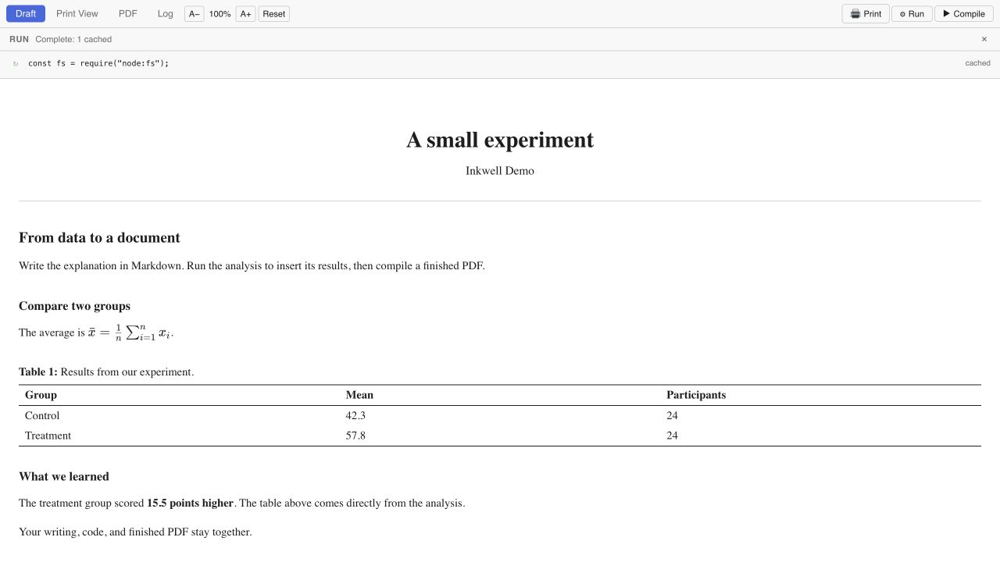
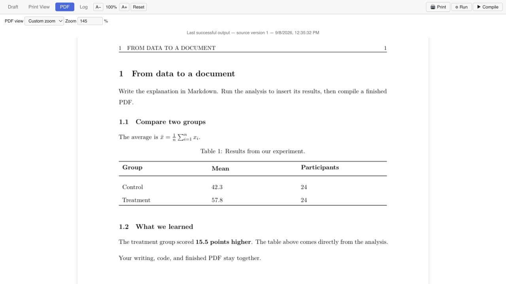

# Inkwell


**Write Markdown in Cursor or VS Code. Turn it into a polished PDF.**

Inkwell puts a live preview, runnable analysis, citations, and LaTeX templates
beside your document. Write a simple report or a journal article; add Python, R,
shell, or JavaScript when you need figures and results.

[Install](#install) · [Your first PDF](#your-first-pdf) · [Controls](#everyday-controls) · [Examples](docs/examples.md) · [Syntax guide](guide.md)

> **Version note:** This page describes **0.5 on `main`**. The latest published
> release and Homebrew cask are **0.4.0**; their interface and setup differ.
> Use the source-build instructions below to try 0.5. Its release VSIX and
> matching Homebrew checksum are not published yet.

## Install

### macOS: latest published release

Install [Cursor](https://cursor.com) or [VS Code](https://code.visualstudio.com)
and [Homebrew](https://brew.sh), then run:

```bash
brew install --cask goldberg-consulting/inkwell/inkwell
```

The current cask installs **0.4.0** and its PDF tools, including MacTeX. This is a
large first download. Reload your editor afterward: open the Command Palette
with **Cmd+Shift+P**, then choose **Developer: Reload Window**.

If Inkwell does not appear, use **Extensions: Install from VSIX...** in the
Command Palette. The current cask keeps its file at
`$(brew --prefix)/share/inkwell/inkwell-0.4.0.vsix` — usually
`/opt/homebrew/share/inkwell/inkwell-0.4.0.vsix` on Apple Silicon or
`/usr/local/share/inkwell/inkwell-0.4.0.vsix` on Intel. You can also download the
extension directly from [Releases](https://github.com/goldberg-consulting/measured.one.inkwell-extension/releases).

<details>
<summary><strong>Try 0.5 now: build and install from source</strong></summary>

With Git, Node.js, and npm installed:

```bash
git clone https://github.com/goldberg-consulting/measured.one.inkwell-extension.git
cd measured.one.inkwell-extension
npm ci
npm run verify
npm run package:vsix
node scripts/verify-vsix.mjs inkwell-0.5.0.vsix --tag v0.5.0
```

In your editor, choose **Extensions: Install from VSIX...**, select
`inkwell-0.5.0.vsix`, and reload the window. Then run **Inkwell: Setup / Repair**.
It checks your tools, offers any needed repairs, prepares the project, and
verifies setup by building a real PDF. On macOS, it can reuse a working TeX
installation or install missing tools after you approve the plan.

</details>

**Linux:** install the VSIX and provide Pandoc 3+, a compatible pandoc-crossref,
TeX Live, and Mermaid CLI using your platform's package managers. In 0.5,
**Setup / Repair** checks these tools and prepares the project; automatic system
installation is currently macOS-only.

For upgrades, existing TeX installations, editor selection, and troubleshooting,
see the [installation guide](docs/installation.md).

## Your first PDF

These steps use **0.5**. Open the Command Palette with **Cmd+Shift+P** on macOS
or **Ctrl+Shift+P** on Linux, then type **Inkwell** to find its commands.

1. Choose **Inkwell: New Project**. Pick a folder, name your document, and select
   **Inkwell Default** for a straightforward report.
2. Follow the setup prompts. Choose the Python environment option to run the
   starter's analysis examples; Python is optional for ordinary writing.
3. Edit the `.md` file that opens. Choose **Inkwell: Open Preview** to see it
   beside your source.
4. If your document has runnable code, click **Run** and wait for it to finish.
5. Click **Compile**, then open the **PDF** tab. Your PDF is saved beside the
   source: `my-report.md` becomes `my-report.pdf`.

**Already have a Markdown project?** Open its folder, run **Inkwell: Setup /
Repair**, then open your document and its preview. Setup preserves your edited
files and offers comparisons when bundled starter files have changed.



*0.5 preview closeup. Write and inspect results in Draft; Compile updates the PDF.*

## Everyday controls

Keep your Markdown editor focused when using these shortcuts. On macOS,
**Option** is the **Alt** key.

| Do this | Toolbar or command | macOS | Linux |
| --- | --- | --- | --- |
| Open the preview | **Inkwell: Open Preview** | Cmd+Shift+V | Ctrl+Shift+V |
| Execute document code | **Run** / **Inkwell: Run Code Blocks** | Cmd+Option+R | Ctrl+Alt+R |
| Build or refresh the PDF | **Compile** / **Inkwell: Compile PDF** | Cmd+Shift+R | Ctrl+Shift+R |
| Stop a running analysis | **Cancel** in the Run panel | — | — |
| Save a PDF somewhere else | **Inkwell: Export PDF to File...** | — | — |

**Run and Compile are separate steps.** After changing analysis code, run it
again, then compile to put the new results in your PDF. Export also recompiles
the document at the location you choose.

The preview's **Print** button currently rebuilds the PDF. To print on paper,
open the saved PDF in a PDF viewer and use its Print command.

### Choose what you see

- **Draft** updates as you type. Use it for writing, math, citations, and results.
- **Print View** approximates the printed page layout while you work.
- **PDF** shows the actual compiled file. Use this to check final page breaks,
  fonts, figures, and references.
- **Log** shows run and compilation messages when something needs attention.

For a `.tex` document, the first tab is **Source** instead of Draft.



*The PDF tab shows the actual compiled report. [Image sources](media/README.md).*

### Change reading size or document style

**Just make it easier to read:** use **A−**, **A+**, and **Reset** in Draft or
Print View. In PDF, use **Fit width**, **Fit page**, or **Custom zoom**. These
viewing controls are remembered and leave the exported document unchanged.

**Change the exported document:** run **Inkwell: Configure Document Style**.
Choose **This document** or **Project defaults**, then adjust a supported font,
size, or spacing option. Save the document and compile again. A lock means the
selected template controls that setting. [More about style](docs/style.md).

**Change the layout:** run **Inkwell: Select LaTeX Template** to set the project
template. A document's `template:` frontmatter takes precedence. Browse the
[ten built-in templates and custom-template guide](docs/templates.md).

**Compile automatically:** open editor Settings, search for
`inkwell.autoCompile`, and choose `onSave` or `interval`. The default is `off`;
the interval defaults to 60 seconds. Automatic compilation does not run your
analysis code.

## Start with a small document

Save this as `my-report.md` in your prepared project, open Preview, and Compile:

```markdown
---
title: My first report
author: Your name
template: default
---

# Findings

Write in **Markdown**, including lists, links, and math: $E = mc^2$.

## Next steps

- Add a figure or table.
- Compile and check the PDF.
```

### Add analysis when you need it

For executable code, use braces around the language name. For example, after
**Inkwell: Setup Python Environment (venv)**:

````markdown
```{python id="summary" display="both"}
values = [12, 18, 24]
print(f"Mean: {sum(values) / len(values):.1f}")
```
````

Click **Run**, then **Compile**. `display="both"` includes the code and its
output; use `output`, `code`, or `none` for other display choices.

For longer analyses, use **Extract Code Block to Script** to move code into an
editable file under `.inkwell/scripts/`. Generated results and run history live
under `.inkwell/runs/`. Declare data files with `inputs=` so changes invalidate
cached results. See [editable scripts and run controls](docs/run-files.md).

### Add references

Use **Inkwell: Configure Bibliography** to select your `.bib` files and citation
style. Type `@` in the document for citation suggestions. Use **Inkwell:
Bibliography Doctor** to diagnose missing files or duplicate keys.
[Citations and cross-references](docs/references.md) explains the details.

## When something needs attention

- **A tool is missing or setup was interrupted:** run **Inkwell: Setup / Repair**.
- **The PDF looks old:** wait for Run to finish, then Compile. Check the PDF tab.
- **A run or compile failed:** open **Log**. For detailed compiler output, open
  the editor's **Output** panel and select **Inkwell LaTeX**.
- **Your font or layout change has no effect:** check for document frontmatter
  overriding project defaults, or a template lock in **Configure Document Style**.

## Go further

- [Example gallery](docs/examples.md) — papers, reports, books, letters, and CVs.
- [Syntax guide](guide.md) — frontmatter, code, figures, math, and diagrams.
- [Configuration](docs/configuration.md) — document settings, project defaults, and upgrades.
- [Tables](docs/tables.md) · [References](docs/references.md) · [Preview behavior](docs/preview-and-performance.md).
- [Releases](https://github.com/goldberg-consulting/measured.one.inkwell-extension/releases) · [Report an issue](https://github.com/goldberg-consulting/measured.one.inkwell-extension/issues).

Contributing? Run `npm run verify` before opening a PR. To build a distributable
extension, use `npm run package:vsix`; see [release verification](docs/release.md).

[License](LICENSE)
