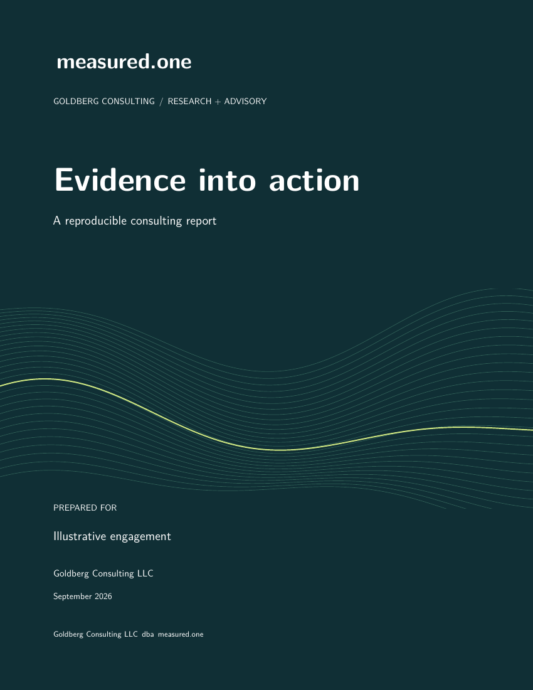

# Inkwell

**Write Markdown. Run your analysis. Publish a polished PDF.**

Inkwell brings a live split preview, Python and JavaScript figures, citations,
and publication templates to Cursor and VS Code.

## Install

1. Download [Inkwell 0.5.2 for Cursor and VS Code](https://github.com/goldberg-consulting/measured.one.inkwell-extension/releases/tag/v0.5.2).
2. Open the Command Palette (**Cmd+Shift+P** on macOS) and choose
   **Extensions: Install from VSIX…**. Select the downloaded file.
3. Run **Developer: Reload Window**, then **Inkwell: Setup / Repair**.
   Setup checks your PDF tools and offers a project Python environment.

Already installed? Start with **Inkwell: New Project**, or open an existing
Markdown document and choose **Inkwell: Open Preview**.

The Homebrew cask currently serves the older 0.4.0 release. Use the VSIX above
for this update. See [installation and troubleshooting](docs/installation.md)
for tool requirements and other platforms.

## Try the measured.one report

A complete Goldberg Consulting example with a US Letter layout, original
vector cover, numbered chapters, and lettered appendices. Its synthetic data
feeds two Python scripts and two Observable Plot scripts in one document.

[View the 10-page PDF](https://github.com/goldberg-consulting/measured.one.inkwell-extension/releases/download/v0.5.1/measured-one-report.pdf) ·
[Download the starter project](https://github.com/goldberg-consulting/measured.one.inkwell-extension/releases/download/v0.5.1/measured-one-starter.zip) ·
[Read the Markdown source](examples/demo-measured-report.md)

<a href="https://github.com/goldberg-consulting/measured.one.inkwell-extension/releases/download/v0.5.1/measured-one-report.pdf"></a>

Unzip the starter and open its folder in Cursor. Open `report.md`, then run
**Inkwell: Setup Python Env** and choose **./.venv**. With Node.js installed,
install the example's JavaScript dependencies once in the project terminal:

```sh
npm ci --prefix .inkwell/scripts/mixed-report
```

Press **Cmd+Shift+V** to open the split preview. Click **Run**, then **Compile**,
and open the **PDF** tab. You can also choose **measured.one Report (US Letter)**
when creating a new project.

The “Signal field” cover is original vector artwork supplied under the
[Inkwell Source License](LICENSE). See [design and artwork provenance](templates/measured-report/LICENSE.md)
for terms and the design reference. No third-party cover photograph is included.

## Write, run, compile

- **Open split preview:** Cmd+Shift+V on macOS; Ctrl+Shift+V on Linux.
- **Run document code:** click **Run**, or Cmd+Option+R on macOS.
- **Compile the PDF:** click **Compile**, or Cmd+Shift+R on macOS.
- **Inspect the result:** choose **PDF** for the compiled file or **Log** for errors.

Save edits to Python, JavaScript, and data files before running. **Run** executes
again; **Run Changed Blocks** reuses verified results. **Compile** uses the
completed results and saves a PDF beside your Markdown file.


For Python, **Inkwell: Setup Python Env** creates the environment, installs your
`requirements.txt`, and updates the current document's environment setting.
New examples use `./.venv`; older documents may explicitly select `./venv`.

Notifications about proposed template or example updates are optional while
writing. Closing or muting them does not block preview, Run, or Compile. Your
edited files remain in place; **Inkwell: Setup Workspace** lets you review updates.

## More examples and help

- [Example gallery](docs/examples.md) — papers, reports, books, letters, and CVs.
- [Templates](docs/templates.md) — choose and customize your document layout.
- [Syntax guide](guide.md) — code, figures, tables, math, and diagrams.
- [Editable scripts and run controls](docs/run-files.md).
- [Citations and references](docs/references.md).
- [Configuration](docs/configuration.md) and [document style](docs/style.md).
- [Report a problem](https://github.com/goldberg-consulting/measured.one.inkwell-extension/issues).

Contributing? Run `npm run verify`, then `npm run package:vsix` to build the
extension. See [release verification](docs/release.md).

[License](LICENSE) · [Image sources](media/README.md)
