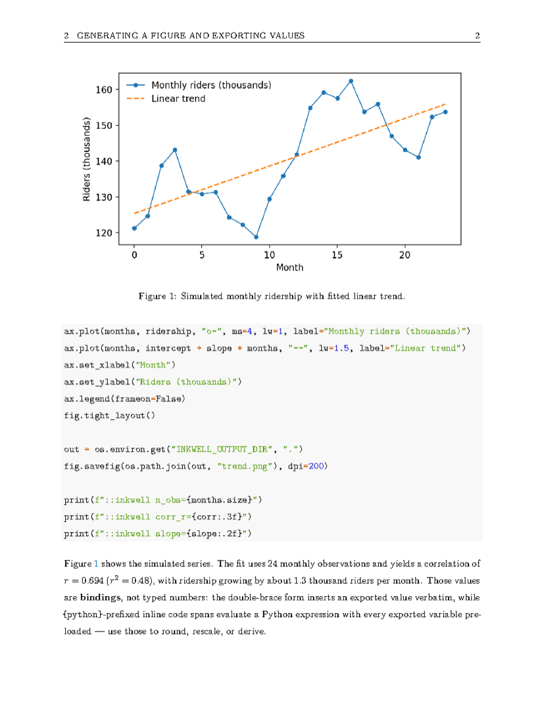
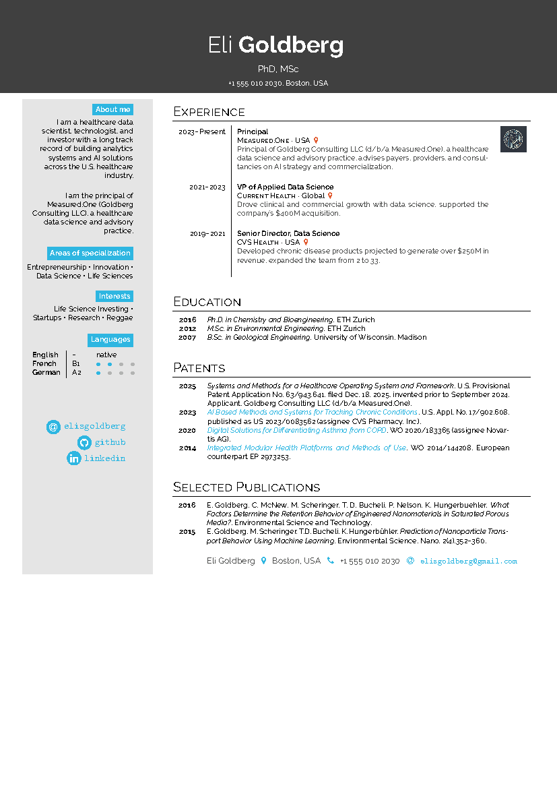
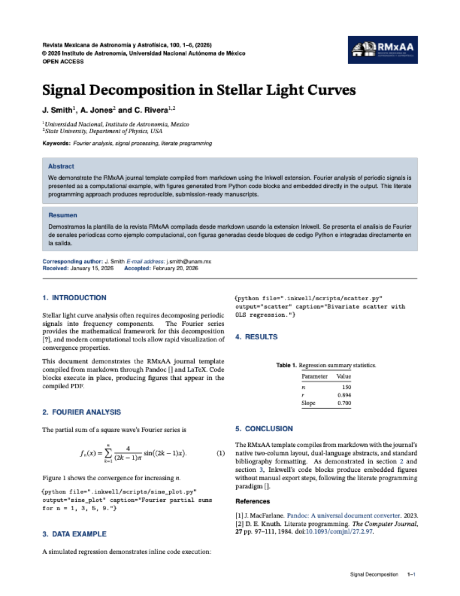
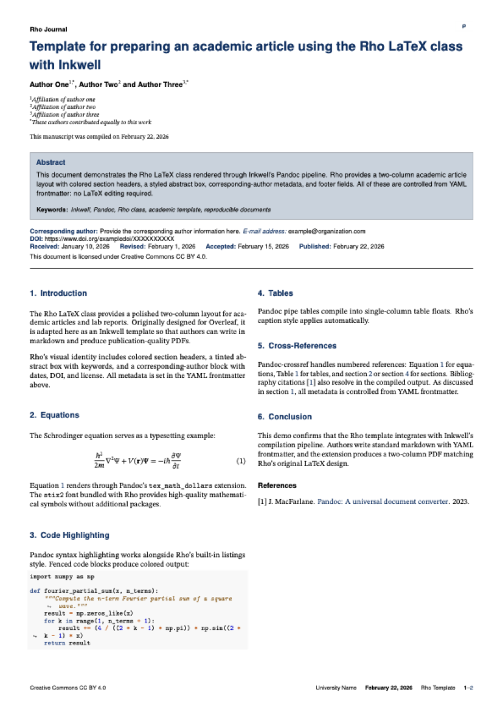
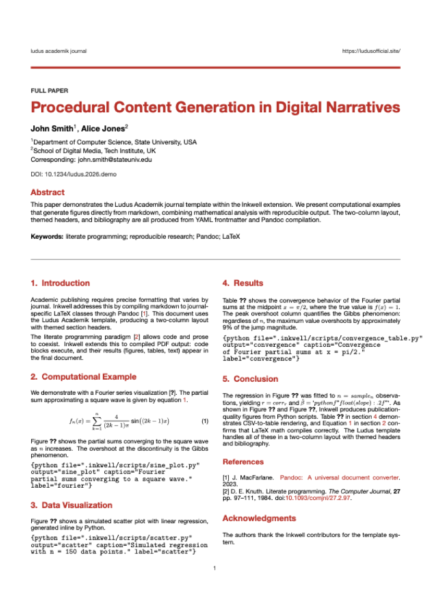

# Examples

The repository's [`examples/`](../examples/) directory contains the Markdown
source for the bundled demos. The gallery below links to each source and its
checked-in rendering image where one is available.

For a checkout, open the **repository root** as the workspace before running an
example. Its tracked root [`.inkwell/`](../.inkwell/) contains the manifest,
shared starter scripts, bibliography, and a figures-directory placeholder used
by the demos. The repository intentionally ignores output caches, copied
scaffold examples, local templates, and generated `.inkwell/figures/*.pdf`
files; those are not repository assets that a fresh checkout can rely on.

**New Project** and **Setup / Repair** copy the bundled example Markdown files
into the target project's `.inkwell/examples/` and seed its starter scripts,
bibliography, and figures directory. They do not copy the gallery screenshots
or generated PDFs. Project-local templates remain user-owned.

To run the Python-backed examples from a checkout:

```bash
python3 -m venv venv
source venv/bin/activate
pip install -r examples/requirements.txt
```

Then open an `examples/*.md` file, run its code blocks, and compile it. For a
new or repaired project, open the corresponding
`.inkwell/examples/*.md` file instead.

## Inkwell Default

Clean single-column article with a table of contents, figures, mathematics, and
syntax-highlighted code.

```yaml
title: "Inkwell Default Template Demo"
author: "Inkwell"
date: "February 2026"
toc: true
lof: true
bibliography: .inkwell/references/refs.bib
inkwell:
  code-bg: "#f5f5f5"
  code-border: true
  tables: booktabs
```

Features: table of contents, numbered equations, runnable Python code with
inline output, figures, tables, and citations.

[Source](../examples/demo-default.md)


## Python Run & Insert

This walkthrough uses Python blocks to generate a figure, table, and values in
the prose. Run the blocks (`Cmd+Alt+R`), compile (`Cmd+Shift+R`), and the PDF
uses the recorded results.

````markdown
```{python display="both" output="trend" caption="Monthly ridership with trend." label="trend"}
# ...compute, save trend.png...
print(f"::inkwell corr_r={corr:.3f}")
```

The fit uses {{n_obs}} observations
and yields $r = {{corr_r}}$
($r^2 = `{python} f"{float(corr_r)**2:.2f}"`$).
````

Features: `::inkwell` exports and `vars.json` bulk bindings, `{{key}}`
substitution, inline `{python}` expressions, generated CSV tables, grouped
numeric citations, and unresolved-binding compile warnings.

[Source](../examples/demo-python-report.md)



## Tufte Handout

Edward Tufte-inspired layout with wide margins for sidenotes, margin figures,
and annotations.

```yaml
template: tufte
title: "On the Principles of Analytical Display"
author: "Inkwell"
date: "February 2026"
abstract: |
  Good information design relies on showing
  the data above all else.
classoption:
  - justified
  - a4paper
bibliography: .inkwell/references/refs.bib
```

Features: raw LaTeX `\marginnote{}` and `\sidenote{}` commands, margin
figures, `\begin{fullwidth}` blocks, Palatino typography, and Markdown
footnotes rendered as numbered sidenotes. `::: {.fullwidth}` is also supported
for full-width content; `::: {.aside}` is unwrapped by Pandoc and does not
produce a margin note.

[Source](../examples/demo-tufte.md) · [PDF](../examples/demo-tufte.pdf)


## Tufte Book VDQI

Full-length book layout using the `tufte-book` class, with a title page and
table of contents styled after *The Visual Display of Quantitative Information*.

```yaml
template: tufte-book-vdqi
title: "A Tufte-Style Book"
subtitle: "With a VDQI Title and Contents Page"
author: "Inkwell"
edition: "First edition"
publisher: "Measured One Press"
top-level-division: chapter
toc: true
lof: true
copyright: true
dedication: |
  Dedicated to readers who prefer evidence.
epigraphs:
  - text: "Above all else show the data."
    author: "Edward R. Tufte"
```

Features: VDQI-style title page, epigraph, copyright and dedication front
matter, `\part{...}` divisions, chapters from `#` headings when
`top-level-division: chapter` is set, and Tufte margin features.

[Source](../examples/demo-tufte-book-vdqi.md) · [PDF](../examples/demo-tufte-book-vdqi.pdf)


## KTH Letter

Official KTH (Royal Institute of Technology) letterhead with an institutional
logo and footer. There is no bundled demo Markdown file; scaffold a project and
select **KTH Letter**, or start from this frontmatter.

```yaml
template: kth-letter
name: "Elis Goldberg"
email: "elis@kth.se"
web: "www.kth.se"
telephone: "+46 8 790 60 00"
dnr: "Dnr: 2026-0042"
recipient:
  - "Prof. Ada Lovelace"
  - "Department of Computing"
  - "University of London"
  - "United Kingdom"
opening: "Dear Professor Lovelace,"
closing: "Kind regards,"
```

Features: KTH letterhead and footer, recipient address block, page numbering,
tables, code highlighting, mathematics, graphics, and hyperlinks.

## Hipster CV

Two-column resume/CV with a full-width name banner, shaded sidebar, language
skill dots, contact bubbles, and a timeline with optional company logos.

```yaml
template: hipster-cv
classoption: [lighthipster]
first-name: "Eli"
last-name: "Goldberg"
tagline: "PhD, MSc"
photo: "headshot.jpeg"
sidebar:
  - title: "About me"
    text: |
      Healthcare data scientist,
      technologist, and investor.
languages:
  - name: English
    note: native
  - name: French
    level: B1
    filled: 2
    empty: 2
contact:
  - icon: At
    text: elisgoldberg
    url: "mailto:eli@example.com"
footer:
  name: "Eli Goldberg"
  location: "Boston, USA"
  email: "eli@example.com"
```

Features: six `classoption` color themes, YAML-driven sidebar, `\cvevent{...}`
timeline entries, `\cvyear{...}` lists, FontAwesome contact bubbles, and
Raleway typography.

[Source](../examples/demo-hipster-cv.md)



## ETH Report

ETH Zürich IVT working paper with title page, abstract, keywords, and a
suggested-citation block.

```yaml
template: eth-report
papertype: "Working Paper"
title: "Signal Decomposition Methods
        for Urban Traffic Flow Analysis"
subtitle: "A Computational Approach"
eth-authors:
  - name: "Author One"
    department: "Department"
    institution: "ETH Zürich"
    address: "CH-8093 Zurich"
    email: "author@ethz.ch"
reportdate: "March 2026"
reportnumber: "1042"
keywords: "keyword1, keyword2"
toc: true
lof: true
lot: true
```

Features: KOMA-Script working-paper title page, report number and date,
abstract and keywords, TOC/LOF/LOT front matter, suggested citation, system
fonts through `mainfont`, and `fontsize`, `geometry`, and `linestretch`
overrides.

[Source](../examples/demo-eth-report.md) · [PDF](../examples/demo-eth-report.pdf)


## RMxAA

Two-column astronomy journal with dual-language abstracts, line numbers, and
the RMxAA masthead.

```yaml
template: rmxaa
classoption: [9pt, twoside]
title: "Signal Decomposition in Stellar
        Light Curves"
rmxaa-authors:
  - name: "J. Smith"
    affiliations: "1"
  - name: "A. Jones"
    affiliations: "2"
rmxaa-affiliations:
  - id: "1"
    text: "Universidad Nacional, ..."
  - id: "2"
    text: "State University, ..."
resumen: |
  Demostramos la plantilla ...
keywords: "Fourier analysis, ..."
vol: 100
received: "January 15, 2026"
accepted: "February 20, 2026"
```

Features: superscripted author-affiliation mapping, Spanish `resumen`, journal
header with volume/pages/year, corresponding-author block, and a two-column
body with numbered sections.

[Source](../examples/demo-rmxaa.md) · [PDF](../examples/demo-rmxaa.pdf)



## TMSCE

Single-column journal with DOI, received/revised/accepted dates, and a keyword
block.

```yaml
template: tmsce
title: "On the Convergence of Fourier
        Partial Sums"
tmsce-authors:
  - name: "J. Smith"
    superscript: "1"
  - name: "A. Jones"
    superscript: "2"
tmsce-affiliations:
  - superscript: "1"
    text: "Dept. of Mathematics, ..."
  - superscript: "2"
    text: "Dept. of Applied Sciences, ..."
journalname: "Transactions on ..."
doi: "https://doi.org/10.0000/..."
keywords: "Fourier series, ..."
received: "15 January 2026"
accepted: "20 February 2026"
```

Features: DOI link, corresponding-author email, configurable journal footer,
keyword and date block, numbered equations, highlighted code, and bibliography.

[Source](../examples/demo-tmsce.md) · [PDF](../examples/demo-tmsce.pdf)


## Rho Academic Article

Two-column academic layout with colored section headers, a styled abstract box,
and footer metadata.

```yaml
template: rho
title: "Paper Title"
journalname: "Rho Journal"
rho-authors:
  - name: "Author One"
    superscript: "1,*"
  - name: "Author Two"
    superscript: "2"
rho-affiliations:
  - superscript: "1"
    text: "First University, ..."
  - superscript: "*"
    text: "Equal contribution"
leadauthor: "Author et al."
logo: "logo.png"
doi: "https://doi.org/10.0000/..."
received: "January 10, 2026"
accepted: "February 15, 2026"
```

Features: colored section headers, keyword box, corresponding-author block
with dates, DOI and license, footer metadata, optional logo, and line numbers.

[Source](../examples/demo-rho.md) · [PDF](../examples/demo-rho.pdf)



## Ludus Academik

Themed two-column layout with color-coded section headers and journal branding.

```yaml
template: ludus
classoption: [red, fullpaper]
title: "Procedural Content Generation
        in Digital Narratives"
shorttitle: "Procedural Content ..."
ludus-authors:
  - name: "John Smith"
    superscript: "1"
  - name: "Alice Jones"
    superscript: "2"
journalname: "LUDUS"
publicationyear: "2026"
articledoi: "10.1234/ludus.2026.demo"
acknowledgments: |
  The authors thank ...
```

Features: `red`, `blue`, `green`, and `orange` themes; `fullpaper` and
`shortpaper` article types; branded journal header; DOI; colored headings; and
an acknowledgments block.

[Source](../examples/demo-ludus.md) · [PDF](../examples/demo-ludus.pdf)


