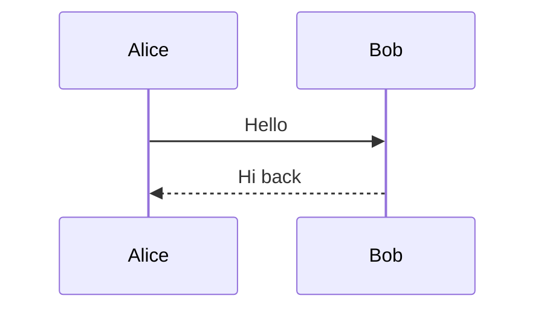

# Inkwell Syntax Guide

Complete reference for writing Inkwell documents. Covers YAML frontmatter, code blocks, inline data binding, math, citations, cross-references, tables, and template-specific fields.

## YAML Frontmatter

Every Inkwell document starts with a `---` fenced YAML block that controls metadata, template selection, and styling.

### Universal fields

```yaml
---
title: "Paper Title"
author: "Author Name"
date: "February 2026"
abstract: |
  Abstract text. Use the pipe character for
  multi-line content.
keywords: "keyword1; keyword2; keyword3"
bibliography: .inkwell/references/refs.bib
link-citations: true
toc: true                          # table of contents
lof: true                          # list of figures
lot: true                          # list of tables
---
```

### Template selection

Set `template:` to use a journal template. Omit it (or set `template: default`) for the default article layout.

```yaml
template: tufte    # or: rho, rmxaa, ludus, tmsce, kth-letter, default
```

### The `inkwell:` styling namespace

Control code and table formatting without touching LaTeX:

```yaml
inkwell:
  code-bg: "#f5f5f5"        # background color for code blocks
  code-border: true          # thin border around code blocks
  code-rounded: true         # rounded corners on code blocks
  code-font-size: small      # tiny, scriptsize, footnotesize, small, normalsize
  tables: booktabs            # booktabs, grid, plain
  table-font-size: small
  table-stripe: true
  hanging-indent: true        # hanging indent for bibliography entries
  columns: 2                  # force two-column layout (default template)
  caption-style: above        # above or below
  code-display: output        # default display mode for code blocks
  python-env: ./venv          # Python virtual environment path
```

### Custom LaTeX in the preamble

Use `header-includes:` to inject arbitrary LaTeX packages or commands:

```yaml
header-includes: |
  \usepackage{xcolor}
  \definecolor{accent}{HTML}{2E86AB}
  \usepackage{tikz}
```

Leave it commented out as a placeholder until needed:

```yaml
# header-includes: |
#   \usepackage{xcolor}
#   \setlength{\parindent}{0pt}
```

### Line numbers

Two-column templates (rho, rmxaa, ludus) support a `linenumbers:` toggle:

```yaml
linenumbers: true    # show line numbers in the margin
linenumbers: false   # no line numbers (default)
```

### Logo

Templates that support a logo in the masthead (rho, ludus, rmxaa) accept:

```yaml
logo: "logo.png"      # path relative to the document
logo: false            # suppress the logo entirely
```

### Cross-reference prefixes

When using `pandoc-crossref`, you can customize how references appear in prose:

```yaml
figPrefix: "figure"
tblPrefix: "table"
eqnPrefix: "equation"
secPrefix: "section"
```

With these set, `@Fig:scatter` renders as "Figure 1", `@Tbl:stats` as "Table 1", etc. Capitalized tags (`@Fig:`) produce capitalized output; lowercase tags (`@fig:`) produce lowercase.

---

## Code Blocks

Inkwell code blocks are fenced with ```` ```{lang} ```` and execute when you run with `Cmd+Alt+R`.

### Syntax

Reference an external script:

````markdown
```{python file=".inkwell/scripts/analysis.py" output="results" caption="Analysis output." label="analysis"}
```
````

Or write code inline:

````markdown
```{python display="both" output="scatter" caption="Scatter plot."}
import numpy as np
# ... your code ...
```
````

### Attributes

| Attribute | Description |
|-----------|-------------|
| `file`    | Path to an external script (relative to the document) |
| `output`  | Name of the artifact to display (matches the filename stem saved to `INKWELL_OUTPUT_DIR`) |
| `display` | Visibility in the compiled PDF: `output`, `both`, `code`, `none` |
| `env`     | Override the Python environment for this block |
| `caption` | Caption text for the figure or table |
| `label`   | Cross-reference label (produces `fig:label` or `tbl:label`) |
| `cache`   | Set to `"false"` to skip caching and re-run every time |

### Languages

`python`, `r`, `shell` / `bash`, `node` / `javascript`.

### Output directory

Scripts write output files to the path in `INKWELL_OUTPUT_DIR`:

```python
import os
out = os.environ.get("INKWELL_OUTPUT_DIR", ".")
fig.savefig(os.path.join(out, "my_figure.png"), dpi=200)
```

### Caching

Results are cached in `.inkwell/outputs/`. Blocks only re-run when their source code changes. Use **Inkwell: Clear Code Block Cache** to force a full re-run.

To suppress caching for a specific block (e.g., one that reads live data or uses randomness without a seed), set `cache="false"`:

````markdown
```{python cache="false" output="live_metrics" caption="Current metrics."}
# this block re-runs every time
```
````

### Display modes

| Mode     | Shows in PDF |
|----------|-------------|
| `output` | Only the output (figure, table, or stdout). This is the default. |
| `both`   | Source code followed by the output |
| `code`   | Source code only, no execution output |
| `none`   | Nothing visible; the block still runs and its exports are available |

Set a document-wide default with `code-display:` in the `inkwell:` namespace.

---

## Mermaid Diagrams

Mermaid diagrams render to high-resolution PNG at compile time via `mmdc` (mermaid-cli) for PDF output, and to SVG for the live HTML preview. Both `{mermaid}` (with attributes) and plain `mermaid` fences are supported. Any diagram type that `mmdc` supports works: flowcharts, sequence diagrams, class diagrams, ER diagrams, state diagrams, Gantt charts, pie charts, and more.

### With caption and cross-reference

````markdown
```{mermaid caption="System architecture" label="arch"}
graph LR
    A[Client] --> B[API]
    B --> C[Database]
```
````

This produces a numbered figure referenceable as `@Fig:arch`.

### Plain (no caption)

````markdown

````

### Supported diagram types

Any diagram type that `mmdc` supports works: `graph`, `sequenceDiagram`, `classDiagram`, `stateDiagram`, `erDiagram`, `gantt`, `pie`, `flowchart`, `gitgraph`, `mindmap`, `timeline`, and others.

### Caching

Rendered diagrams are cached in `.inkwell/mermaid/` by content hash (both SVG for preview and PNG for PDF). A diagram only re-renders when its source changes.

### Prerequisites

Install mermaid-cli globally:

```bash
npm install -g @mermaid-js/mermaid-cli
```

If `mmdc` is not installed, mermaid blocks pass through as code listings in the compiled PDF but still render in the live preview (client-side via mermaid.js).

---

## Inline Data Binding

Code blocks can export named values that you reference later in prose, captions, or table cells. There are two mechanisms.

### Exporting values

Print `::inkwell key=value` lines from any code block:

```python
print(f"::inkwell sample_n={len(x)}")
print(f"::inkwell corr_r={r_val:.3f}")
print(f"::inkwell slope={m:.3f}")
```

These lines are stripped from visible stdout. The values are collected into a variable store available to the rest of the document.

You can also export from a `vars.json` artifact:

```python
import json, os
out = os.environ.get("INKWELL_OUTPUT_DIR", ".")
with open(os.path.join(out, "vars.json"), "w") as f:
    json.dump({"sample_n": 150, "corr_r": 0.871}, f)
```

### Variable substitution: `{{key}}`

Inserts the raw exported value as-is. Good for integers, short strings, or values that need no formatting:

```markdown
The dataset contains {{sample_n}} observations with Pearson r = {{corr_r}}.
```

### Inline expressions: `` `{python} expr` ``

Evaluates any Python expression. All exported variables are pre-loaded as strings, so cast with `float()`, `int()`, etc. as needed:

```markdown
Formatted: $r = `{python} f"{float(corr_r):.2f}"`$
Arithmetic: ratio is `{python} f"{float(slope) / float(corr_r):.2f}"`.
Conditional: `{python} "significant" if float(corr_r) > 0.5 else "weak"`.
```

Inline expressions support f-strings, arithmetic, function calls, and ternary conditionals. Results are cached based on the expression text and variable values.

### Where you can use them

Both `{{key}}` and `` `{python} expr` `` work in:

- Body prose
- Figure and table captions (via the `caption` attribute)
- Inside LaTeX math: `$r = `{python} f"{float(corr_r):.2f}"`$`
- Markdown table cells

---

## Tables

### Static markdown tables

Standard pipe tables compile with booktabs formatting:

```markdown
| Method    | Time (ms) | Accuracy (%) |
|-----------|----------:|-------------:|
| Baseline  |      12.5 |         91.2 |
| Proposed  |      10.1 |         93.8 |

: Caption text for the table. {#tbl:methods}
```

The `: Caption text. {#tbl:label}` line below the table provides a caption and a cross-reference label.

### Code-generated CSV tables

A code block that writes a `.csv` file to `INKWELL_OUTPUT_DIR` renders as a formatted table:

````markdown
```{python output="summary" caption="Descriptive statistics." label="stats"}
import os
out = os.environ.get("INKWELL_OUTPUT_DIR", ".")
with open(os.path.join(out, "summary.csv"), "w") as f:
    f.write("Variable,n,Mean,Std\n")
    f.write("x,150,-0.05,0.85\n")
    f.write("y,150,-0.05,0.71\n")
```
````

### Code-generated JSON tables

A block that writes a JSON array of objects renders as a table too:

```python
import json, os
out = os.environ.get("INKWELL_OUTPUT_DIR", ".")
data = [{"Method": "A", "Score": 0.92}, {"Method": "B", "Score": 0.95}]
with open(os.path.join(out, "results.json"), "w") as f:
    json.dump(data, f)
```

---

## Math

### Inline math

Standard LaTeX between single dollar signs: `$x^2 + y^2 = r^2$`.

### Display math

Pandoc `tex_math_dollars` with optional cross-reference label:

```markdown
$$E = mc^2$$ {#eq:einstein}
```

Or raw LaTeX equation environments (labels work directly):

```latex
\begin{equation}\label{eq:fourier}
f_n(x) = \sum_{k=1}^{n} \frac{4}{(2k-1)\pi}\sin\bigl((2k-1)x\bigr)
\end{equation}
```

Both `\label{eq:name}` and `{#eq:name}` produce referenceable equation numbers.

### Theorem environments

The default template provides theorem-like blocks:

```markdown
::: {.theorem}
**Cauchy-Schwarz Inequality.** For all vectors $u, v$ in an inner product space,
$$|\langle u, v \rangle|^2 \leq \langle u, u \rangle \cdot \langle v, v \rangle$$
:::
```

Available classes: `.theorem`, `.lemma`, `.proposition`, `.corollary`, `.definition`, `.example`, `.remark`.

---

## Citations and Bibliography

### Setup

Point to a `.bib` file in your frontmatter:

```yaml
bibliography: .inkwell/references/refs.bib
link-citations: true
```

Inkwell runs `--citeproc` automatically. Place a `## References` heading where you want the bibliography to appear (typically at the end).

### Syntax

| Syntax | Renders as |
|--------|------------|
| `[@knuth1984]` | (Knuth, 1984) |
| `[@knuth1984; @harris2020]` | (Knuth, 1984; Harris et al., 2020) |
| `@knuth1984` | Knuth (1984) |
| `[@knuth1984, p. 42]` | (Knuth, 1984, p. 42) |

---

## Cross-References

Inkwell uses `pandoc-crossref` for numbered figure, table, equation, and section references.

### Labeling

| Element | Label syntax |
|---------|-------------|
| Figure (from code block) | `label="scatter"` attribute on the code block |
| Figure (from markdown) | `{#fig:scatter}` |
| Table | `: Caption text. {#tbl:stats}` below the pipe table |
| Equation (Pandoc style) | `$$E = mc^2$$ {#eq:einstein}` |
| Equation (LaTeX style) | `\label{eq:einstein}` inside an equation environment |
| Section | `# Introduction {#sec:intro}` |

### Referencing

| Reference | Output |
|-----------|--------|
| `@Fig:scatter` | Figure 1 |
| `@fig:scatter` | figure 1 |
| `@Tbl:stats` | Table 1 |
| `@Eq:einstein` | Equation 1 |
| `@eq:einstein` | equation 1 |
| `@sec:intro` | section 1 |

Capitalized tags produce capitalized prefixes. Customize the prefix text with `figPrefix`, `tblPrefix`, `eqnPrefix`, `secPrefix` in YAML.

---

## Templates

### Default (XeLaTeX)

Clean single-column article. No `template:` field needed.

```yaml
title: "Paper Title"
author: "Author Name"
date: "February 2026"
linestretch: 1.4
geometry: "margin=1in"
```

Additional fields: `subtitle`, `fontsize`, `mainfont`, `sansfont`, `monofont`, `documentclass`.

### Tufte Handout (pdfLaTeX)

Edward Tufte-inspired layout with wide margins for sidenotes, margin figures, and annotations. Uses the `tufte-handout` class from CTAN with Palatino typography.

```yaml
template: tufte
title: "Handout Title"
author: "Author Name"
date: "February 2026"
abstract: |
  Abstract text appears below the title.
classoption:
  - justified        # justified text (default is ragged-right)
  - a4paper          # or: letterpaper (default)
  - sfsidenotes      # sans-serif sidenotes (optional)
```

Additional fields: `subtitle`, `linkcolor`, `citecolor`, `urlcolor`.

#### Margin notes

Use `::: {.aside}` fenced divs for margin notes:

```markdown
::: {.aside}
This text appears in the margin alongside the main column.
:::
```

For inline margin notes, use raw LaTeX: `\marginnote{Short note.}` or `\sidenote{Numbered note.}`.

#### Margin figures

Use raw LaTeX for figures placed in the margin:

```markdown
\begin{marginfigure}
\centering
\includegraphics[width=\linewidth]{.inkwell/figures/small-plot.pdf}
\caption{A plot in the margin.}
\end{marginfigure}
```

Standard `` images appear in the main column with captions set in the margin by the Tufte class.

#### Full-width sections

Extend content into the margin area with `::: {.fullwidth}`:

```markdown
::: {.fullwidth}
This paragraph and any tables or figures within it
span the full page width, including the margin.
:::
```

#### New thoughts

Use `\newthought{Opening words}` to start a paragraph with small-caps, following Tufte's convention:

```markdown
\newthought{The central argument} of this section is that...
```

### KTH Letter (pdfLaTeX)

Official KTH (Royal Institute of Technology) letterhead. Produces a formatted letter with institutional logo, address block, and footer.

```yaml
template: kth-letter
name: "Sender Name"
email: "sender@kth.se"
web: "www.kth.se"
telephone: "+46 8 790 60 00"
dnr: "Dnr: 2026-0042"
recipient:
  - "Recipient Name"
  - "Department"
  - "Address Line"
  - "Country"
opening: "Dear Dr. Name,"
closing: "Kind regards,"
```

Additional fields: `location` (office address), `signature-name` (for the signature block), `signature-cols` (number of signature columns for multiple signatories), `cc` (carbon copy), `encl` (enclosures), `classoption` (e.g. `a4paper`, `nofoot`).

The `recipient` field accepts a list; each item becomes a line in the address block. The body of the markdown file becomes the letter content between the salutation and closing. The template supports section headings, tables (`booktabs`/`longtable`), code blocks with syntax highlighting, math (`amsmath`), graphics, and hyperlinks. Use `header-includes` to inject custom preamble commands such as `\date{...}` or `\signature[1]{...}`.

### Rho Academic Article (pdfLaTeX)

Two-column layout with colored section headers, abstract box, and footer metadata.

```yaml
template: rho
title: "Paper Title"
journalname: "Journal Name"
rho-authors:
  - name: "Author One"
    superscript: "1,*"
  - name: "Author Two"
    superscript: "2"
rho-affiliations:
  - superscript: "1"
    text: "First University, Department, Country"
  - superscript: "2"
    text: "Second University, Department, Country"
  - superscript: "*"
    text: "These authors contributed equally"
dates: "Compiled on February 22, 2026"
leadauthor: "Author et al."
footinfo: "Creative Commons CC BY 4.0"
smalltitle: "Short Title"
institution: "University Name"
theday: "February 22, 2026"
corres: "Corresponding author information."
email: "author@university.edu"
doi: "https://doi.org/10.0000/example"
received: "January 10, 2026"
revised: "February 1, 2026"
accepted: "February 15, 2026"
published: "February 22, 2026"
license: "Creative Commons CC BY 4.0."
logo: "logo.png"
```

### RMxAA (pdfLaTeX)

Revista Mexicana de Astronomia y Astrofisica. Two-column with dual-language abstracts.

```yaml
template: rmxaa
classoption: [9pt, twoside]
title: "Paper Title"
rmxaa-authors:
  - name: "J. Smith"
    affiliations: "1"
  - name: "A. Jones"
    affiliations: "2"
  - name: "C. Rivera"
    affiliations: "1,2"
rmxaa-affiliations:
  - id: "1"
    text: "Universidad Nacional, Instituto de Astronomia, Mexico"
  - id: "2"
    text: "State University, Department of Physics, USA"
leadauthor: "Smith et al."
smalltitle: "Short Title"
corresponding-author: "J. Smith"
corresponding-email: "j.smith@unam.mx"
resumen: |
  Spanish abstract here.
vol: 100
pages: "1--6"
yearofpub: 2026
received: "January 15, 2026"
accepted: "February 20, 2026"
linenumbers: false
```

### Ludus Academik (XeLaTeX)

Themed two-column journal with color-coded headers.

```yaml
template: ludus
classoption:
  - red              # theme: red, blue, green, orange
  - fullpaper         # type: fullpaper, shortpaper
title: "Paper Title"
shorttitle: "Short Title"
shortauthor: "Smith & Jones"
ludus-authors:
  - name: "John Smith"
    superscript: "1"
  - name: "Alice Jones"
    superscript: "2"
ludus-affiliations:
  - superscript: "1"
    text: "Department of Computer Science, State University, USA"
  - superscript: "2"
    text: "School of Digital Media, Tech Institute, UK"
corresponding-email: "john.smith@stateuniv.edu"
journalname: "LUDUS"
journalsubtitle: "International Journal of Game Studies"
publicationyear: 2026
articledoi: "10.1234/ludus.2026.demo"
acknowledgments: |
  The authors thank the reviewers.
```

### TMSCE (pdfLaTeX)

Transactions on Mathematical Sciences and Computational Engineering. Single-column.

```yaml
template: tmsce
title: "Paper Title"
tmsce-authors:
  - name: "J. Smith"
    superscript: "1"
  - name: "A. Jones"
    superscript: "2"
tmsce-affiliations:
  - superscript: "1"
    text: "Department of Mathematics, State University, USA"
  - superscript: "2"
    text: "Department of Applied Sciences, Tech Institute, UK"
corresponding-email: "j.smith@stateuniv.edu"
journalname: "Transactions on Mathematical Sciences and Computational Engineering"
doi: "10.0000/tmsce.2026.042"
vol: 1
issue: 1
yearofpub: 2026
pagerange: "1--8"
received: "15 January 2026"
revised: "10 February 2026"
accepted: "20 February 2026"
```

Additional fields: `copyrightline`, `permissions`. The `journalname` field sets the text in the page footer; if omitted, the default class name is used.

---

## Converting Existing Documents

### From LaTeX

| LaTeX | Markdown |
|-------|----------|
| `\section{Title}` | `# Title` |
| `\subsection{Title}` | `## Title` |
| `\textbf{text}` | `**text**` |
| `\textit{text}` | `*text*` |
| `\texttt{code}` | `` `code` `` |
| `$x^2$` | `$x^2$` (keep as-is) |
| `\begin{equation}...\end{equation}` | Keep as raw LaTeX |
| `\begin{align}...\end{align}` | Keep as raw LaTeX |
| `\cite{key}` | `[@key]` |
| `\citep{key}` | `[@key]` |
| `\citet{key}` | `@key` |
| `\cite{a,b}` | `[@a; @b]` |
| `\ref{fig:label}` | `@fig:label` |
| `\eqref{eq:label}` | `\eqref{eq:label}` (keep as-is) |
| `\footnote{text}` | `[^n]` with `[^n]: text` at the bottom |
| `\url{...}` | `<url>` |
| `\href{url}{text}` | `[text](url)` |
| `\includegraphics[opts]{path}` | `{width=...}` |
| `\bibliographystyle{...}` | Remove; use `bibliography:` in frontmatter |
| `\usepackage{...}` | Remove, or move to `header-includes:` if truly needed |
| `\newcommand{...}` | Move to `header-includes:` |
| `\maketitle`, `\begin{document}` | Remove |

### From plain markdown

1. Preserve any existing YAML frontmatter and extend it with Inkwell fields.
2. Convert ` ```python ` fences to ` ```{python} ` if you want them to execute.
3. Add `bibliography:` if the document contains citation syntax.
4. Verify image paths are relative to the document.

### Things to keep as raw LaTeX

Do not convert these; Inkwell passes raw LaTeX through to the PDF engine:

- Equation environments: `equation`, `align`, `gather`, `cases`, `bmatrix`
- Theorem environments when using custom definitions
- TikZ pictures
- Custom environments defined in `header-includes`
- `\label` and `\eqref` inside math
- Anything under `header-includes`

---

## Tips

**Reload after rebuilding.** If you rebuild the extension from source (`npm run compile`), reload the editor with `Cmd+Shift+P` > **Developer: Reload Window**.

**Re-run after adding exports.** If you add `::inkwell` print lines to a code block, re-run the block (`Cmd+Alt+R`) before compiling so the variable store picks up the new values.

**Clear cache when stuck.** If outputs seem stale, run **Inkwell: Clear Code Block Cache** and re-run all blocks.

**Use `display="none"` for setup blocks.** Blocks that only export variables or install dependencies can be hidden from the PDF with `display="none"`.

**Static images.** Place static images (not generated by code) in `.inkwell/figures/` and reference them with `{#fig:label}`.

**Two-column table overflow.** Two-column templates automatically shrink tables to fit. If a table still overflows, reduce the number of columns or use abbreviations in headers.

**Long code lines.** Code blocks automatically wrap long lines in the PDF. Use `code-font-size: footnotesize` or `code-font-size: scriptsize` if lines are still too wide.

## Troubleshooting

Run **Inkwell: Check / Install Toolchain** from the command palette first — it diagnoses all of the conditions below and surfaces one-click remediations for most of them. The list here is a reference for what those messages mean.

### Compile fails with "You haven't defined the language 'spanish' yet"

Affects the **rho** and **rmxaa** templates on TinyTeX / BasicTeX installs. Fixed in Inkwell 0.3.0+ by loading Spanish alongside English in the template wrappers. If you see this on an older version, upgrade the extension (`brew upgrade --cask inkwell`) or add `babel-spanish` and `hyphen-spanish` to your local `requirements-latex.txt` and run **Inkwell: Check / Install Toolchain**.

### Compile fails with "File 'xstring.sty' not found" (or fixtounicode, fix2col, ...)

Your TeX distribution is missing a package that a shipped template depends on. On a clean TinyTeX install these are not present by default; the full package list ships in `requirements-latex.txt`. Run **Inkwell: Check / Install Toolchain** → *Install packages with tlmgr*, or run the command directly:

```bash
sed 's/#.*//' <path-to-requirements-latex.txt> | awk 'NF' | xargs tlmgr install
texhash || mktexlsr
```

### Compiled PDF shows "??" where cross-references should be

Affects any document that uses `@fig:`, `@tbl:`, `@eq:`, `@sec:`, `\ref{…}`, `\pageref{LastPage}`, or `\tableofcontents`. Fixed in Inkwell 0.3.0+: the compile pipeline now runs the engine twice so LaTeX can resolve cross-references via `.aux`. If you still see `??` on an older version, compile twice in a row (the second run will resolve) or upgrade.

### tlmgr install succeeds but compile still reports "file not found"

Symptom of a root-owned TeX tree. Common after:

- Bootstrapping TinyTeX with `curl … | sudo sh`
- Copying a `~/Library/TinyTeX/` tree from another machine
- Running an aborted `brew install --cask basictex` as root

When the TEXMFROOT directory is owned by a user other than the one running Inkwell, `tlmgr install` as your user fails to update the `ls-R` file index — the packages are on disk but `kpsewhook` can't find them. The extension detects this in **Inkwell: Check / Install Toolchain** and offers a one-click fix. Manually:

```bash
sudo chown -R "$USER" "$(kpsewhich -var-value TEXMFROOT)"
texhash
```

Re-run the toolchain check afterward to confirm.

### Preview shows raw LaTeX syntax instead of rendered output

Reload the editor window: `Cmd+Shift+P` → **Developer: Reload Window**. After a `brew upgrade --cask inkwell`, VS Code / Cursor keeps the old extension code loaded in memory until the window reloads.

### I want to see the exact pandoc / xelatex invocation

Open the **Inkwell** output channel (*View* > *Output* > *Inkwell* in the dropdown). Every compile logs the full `pandoc` argv, resolved `TEXINPUTS`, and `--resource-path` so you can reproduce the failure outside the extension without reading the bundle. Each engine pass is logged separately.

### Mermaid diagrams show as code in the PDF

Install the Mermaid CLI globally: `npm install -g @mermaid-js/mermaid-cli`. Inkwell shells out to `mmdc` to rasterize each diagram; without it, the fenced code survives to the PDF unrendered. **Inkwell: Check / Install Toolchain** flags this when it's missing.

### Preview and PDF agree but differ from what I expect

Preview is an HTML simulation of what LaTeX will produce. For structural correctness (refs, bibliography, numbering) preview and PDF should match post-compile. Visual differences (font, spacing, column breaks) are inherent to the two rendering engines — the PDF is authoritative for layout; the preview is authoritative for write-time feedback.
