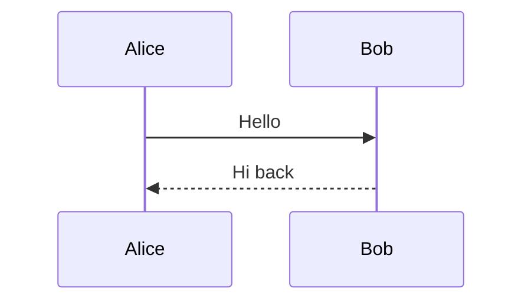

# Inkwell Syntax Guide

Complete reference for writing Inkwell documents. Covers YAML frontmatter, code blocks, inline data binding, math, citations, cross-references, tables, and template-specific fields.

## Document style and preview readability

Use **Inkwell: Configure Document Style** to update document frontmatter with an
undoable edit or set project defaults. The picker reports template locks and
preserves existing metadata. Default and ETH Report support physical body sizes
of 10, 11, and 12 pt and configurable heading, code, table, caption, and reference
sizes. The picker identifies supported values and template limitations.

Use **A−**, **A+**, and **Reset** in the preview for a remembered 50–200% readability
scale. The command palette provides the same controls. This does not change
frontmatter or the compiled PDF. The PDF pane has its own fit-width, fit-page,
and custom zoom controls.

## Setup and health checks

Use **Inkwell: Setup / Repair** to inspect the installed tools, review any system
changes, prepare the workspace, and verify a real PDF. The first-run walkthrough
and New Project use the same observed setup flow. Interrupted setup can be resumed
by running the command again; a failed process never counts as a completed stage.

Health checks do not install software or change a TeX tree. Activation uses only
a cached light result. A fresh light check verifies assets, executable versions,
editor versions, and workspace state. A full check adds a cross-reference fixture,
the installed artifact's exact TeX requirements, ownership classification, and a
temporary PDF build. Setup applies changes only through its separate installation
and workspace stages. Its diagnostics distinguish passed, warning, failed, and
skipped checks.

On macOS, setup reuses a functioning TeX installation. Full MacTeX is the default
when TeX is missing; an explicitly selected lean profile uses BasicTeX and must
pass the same checks. Existing user-owned TinyTeX does not need sudo, and normal
system MacTeX ownership is preserved. Mermaid CLI comes from Homebrew's
`mermaid-cli` formula.

## YAML Frontmatter

Every Inkwell document starts with a `---` fenced YAML block that controls metadata, template selection, and styling.

### Universal fields

```yaml
---
title: "Paper Title"
author: "Author Name"
date: "February 2026"
abstract: |
  Abstract text. Use the pipe character for
  multi-line content.
keywords: "keyword1; keyword2; keyword3"
bibliography: .inkwell/references/refs.bib
link-citations: true
toc: true                          # table of contents
lof: true                          # list of figures
lot: true                          # list of tables
---
```

### Template selection

Set `template:` to use a journal template. Omit it (or set `template: default`) for the default article layout.

```yaml
template: tufte    # or: tufte-book-vdqi, rho, rmxaa, ludus, tmsce, eth-report, kth-letter, hipster-cv, default
```

### The `inkwell:` styling namespace

Control code and table formatting without touching LaTeX:

```yaml
inkwell:
  code-bg: "#f5f5f5"        # background color for code blocks
  code-border: true          # thin border around code blocks
  code-rounded: true         # rounded corners on code blocks
  code-font-size: small      # tiny, scriptsize, footnotesize, small, normalsize
  tables: booktabs            # booktabs, grid, plain, zebra, compact
  table-font-size: small
  table-stripe: true
  hanging-indent: true        # hanging indent for bibliography entries
  columns: 2                  # force two-column layout (default template)
  caption-style: above        # above or below
  code-display: output        # default display mode for code blocks
  python-env: ./venv          # Python virtual environment path
```

For the full table model, per-table overrides, literal CSV/JSON cells, and
template capability limits, see [Body tables](docs/tables.md). Canonical
`tables: {...}` settings and legacy flat keys use the same preview/PDF model.

### Custom LaTeX in the preamble

Use `header-includes:` to inject arbitrary LaTeX packages or commands:

```yaml
header-includes: |
  \usepackage{xcolor}
  \definecolor{accent}{HTML}{2E86AB}
  \usepackage{tikz}
```

`header-includes:` composes with the `inkwell:` styling namespace: Inkwell
merges its generated styling into the template ahead of your block, so your
commands render after it and win any conflict (for example, your own
`Highlighting` or `Shaded` redefinition overrides `code-font-size` /
`code-border`). You do not have to choose between the two mechanisms.

Leave it commented out as a placeholder until needed:

```yaml
# header-includes: |
#   \usepackage{xcolor}
#   \setlength{\parindent}{0pt}
```

### Line numbers

Two-column templates (rho, rmxaa, ludus) support a `linenumbers:` toggle:

```yaml
linenumbers: true    # show line numbers in the margin
linenumbers: false   # no line numbers (default)
```

### Logo

Templates that support a logo in the masthead (rho, ludus, rmxaa) accept:

```yaml
logo: "logo.png"      # path relative to the document
logo: false            # suppress the logo entirely
```

### Cross-reference prefixes

When using `pandoc-crossref`, you can customize how references appear in prose:

```yaml
figPrefix: "figure"
tblPrefix: "table"
eqnPrefix: "equation"
secPrefix: "section"
```

With these set, `@Fig:scatter` renders as "Figure 1", `@Tbl:stats` as "Table 1", etc. Capitalized tags (`@Fig:`) produce capitalized output; lowercase tags (`@fig:`) produce lowercase.

---

## Code Blocks

Inkwell code blocks are fenced with ```` ```{lang} ```` and execute when you run with `Cmd+Alt+R`.

### Syntax

Reference an external script:

````markdown
```{python file=".inkwell/scripts/analysis.py" output="results" caption="Analysis output." label="analysis"}
```
````

Or write code inline:

````markdown
```{python display="both" output="scatter" caption="Scatter plot."}
import numpy as np
# ... your code ...
```
````

### Attributes

| Attribute | Description |
|-----------|-------------|
| `file`    | Path to an external script (relative to the document) |
| `output`  | Name of the artifact to display (matches the filename stem saved to `INKWELL_OUTPUT_DIR`) |
| `display` | Visibility in the compiled PDF: `output`, `both`, `code`, `none` |
| `env`     | Override the Python environment for this block |
| `caption` | Caption text for the figure or table |
| `label`   | Cross-reference label (produces `fig:label` or `tbl:label`) |
| `cache`   | Set to `"false"` to skip caching and re-run every time |

### Languages

`python`, `r`, `shell` / `bash`, `node` / `javascript`.

### Output directory

Scripts write output files to the path in `INKWELL_OUTPUT_DIR`:

```python
import os
out = os.environ.get("INKWELL_OUTPUT_DIR", ".")
fig.savefig(os.path.join(out, "my_figure.png"), dpi=200)
```

### Caching

Results are cached in `.inkwell/outputs/`. Blocks only re-run when their source code changes. Use **Inkwell: Clear Code Block Cache** to force a full re-run.

To suppress caching for a specific block (e.g., one that reads live data or uses randomness without a seed), set `cache="false"`:

````markdown
```{python cache="false" output="live_metrics" caption="Current metrics."}
# this block re-runs every time
```
````

### Display modes

| Mode     | Shows in PDF |
|----------|-------------|
| `output` | Only the output (figure, table, or stdout). This is the default. |
| `both`   | Source code followed by the output |
| `code`   | Source code only, no execution output |
| `none`   | Nothing visible; the block still runs and its exports are available |

Set a document-wide default with `code-display:` in the `inkwell:` namespace.

---

## Mermaid Diagrams

Mermaid diagrams render to high-resolution PNG at compile time via `mmdc` (mermaid-cli) for PDF output, and to SVG for the live HTML preview. Both `{mermaid}` (with attributes) and plain `mermaid` fences are supported. Any diagram type that `mmdc` supports works: flowcharts, sequence diagrams, class diagrams, ER diagrams, state diagrams, Gantt charts, pie charts, and more.

### With caption and cross-reference

````markdown
```{mermaid caption="System architecture" label="arch"}
graph LR
    A[Client] --> B[API]
    B --> C[Database]
```
````

This produces a numbered figure referenceable as `@Fig:arch`.

### Plain (no caption)

````markdown

```mermaid
sequenceDiagram
    Alice->>Bob: Hello
    Bob-->>Alice: Hi back
```
````

### Supported diagram types

Any diagram type that `mmdc` supports works: `graph`, `sequenceDiagram`, `classDiagram`, `stateDiagram`, `erDiagram`, `gantt`, `pie`, `flowchart`, `gitgraph`, `mindmap`, `timeline`, and others.

### Caching

Rendered diagrams are cached in `.inkwell/mermaid/` by content hash (both SVG for preview and PNG for PDF). A diagram only re-renders when its source changes.

### Prerequisites

Run **Inkwell: Setup / Repair**. On macOS, Mermaid CLI is installed through the Homebrew `mermaid-cli` formula and verified before setup completes.

If `mmdc` is not installed, mermaid blocks pass through as code listings in the compiled PDF but still render in the live preview (client-side via mermaid.js).

---

## Inline Data Binding

Code blocks can export named values that you reference later in prose, captions, or table cells. There are two mechanisms.

### Exporting values

Print `::inkwell key=value` lines from any code block:

```python
print(f"::inkwell sample_n={len(x)}")
print(f"::inkwell corr_r={r_val:.3f}")
print(f"::inkwell slope={m:.3f}")
```

These lines are stripped from visible stdout. The values are collected into a variable store available to the rest of the document.

You can also export from a `vars.json` artifact:

```python
import json, os
out = os.environ.get("INKWELL_OUTPUT_DIR", ".")
with open(os.path.join(out, "vars.json"), "w") as f:
    json.dump({"sample_n": 150, "corr_r": 0.871}, f)
```

### Variable substitution: `{{key}}`

Inserts the raw exported value as-is. Good for integers, short strings, or values that need no formatting:

```markdown
The dataset contains {{sample_n}} observations with Pearson r = {{corr_r}}.
```

### Inline expressions: `` `{python} expr` ``

Evaluates any Python expression. All exported variables are pre-loaded as strings, so cast with `float()`, `int()`, etc. as needed:

```markdown
Formatted: $r = `{python} f"{float(corr_r):.2f}"`$
Arithmetic: ratio is `{python} f"{float(slope) / float(corr_r):.2f}"`.
Conditional: `{python} "significant" if float(corr_r) > 0.5 else "weak"`.
```

Inline expressions support f-strings, arithmetic, function calls, and ternary conditionals. Results are cached based on the expression text and variable values.

### Where you can use them

Both `{{key}}` and `` `{python} expr` `` work in:

- Body prose
- Figure and table captions (via the `caption` attribute)
- Inside LaTeX math: `$r = `{python} f"{float(corr_r):.2f}"`$`
- Markdown table cells

---

## Tables

### Static markdown tables

Standard pipe tables compile with booktabs formatting:

```markdown
| Method    | Time (ms) | Accuracy (%) |
|-----------|----------:|-------------:|
| Baseline  |      12.5 |         91.2 |
| Proposed  |      10.1 |         93.8 |

: Caption text for the table. {#tbl:methods}
```

The `: Caption text. {#tbl:label}` line below the table provides a caption and a cross-reference label.

### Code-generated CSV tables

A code block that writes a `.csv` file to `INKWELL_OUTPUT_DIR` renders as a formatted table:

````markdown
```{python output="summary" caption="Descriptive statistics." label="stats"}
import os
out = os.environ.get("INKWELL_OUTPUT_DIR", ".")
with open(os.path.join(out, "summary.csv"), "w") as f:
    f.write("Variable,n,Mean,Std\n")
    f.write("x,150,-0.05,0.85\n")
    f.write("y,150,-0.05,0.71\n")
```
````

### Code-generated JSON tables

A block that writes a JSON array of objects renders as a table too:

```python
import json, os
out = os.environ.get("INKWELL_OUTPUT_DIR", ".")
data = [{"Method": "A", "Score": 0.92}, {"Method": "B", "Score": 0.95}]
with open(os.path.join(out, "results.json"), "w") as f:
    json.dump(data, f)
```

---

## Math

### Inline math

Standard LaTeX between single dollar signs: `$x^2 + y^2 = r^2$`.

### Display math

Pandoc `tex_math_dollars` with optional cross-reference label:

```markdown
$$E = mc^2$$ {#eq:einstein}
```

Or raw LaTeX equation environments (labels work directly):

```latex
\begin{equation}\label{eq:fourier}
f_n(x) = \sum_{k=1}^{n} \frac{4}{(2k-1)\pi}\sin\bigl((2k-1)x\bigr)
\end{equation}
```

Both `\label{eq:name}` and `{#eq:name}` produce referenceable equation numbers.

### Theorem environments

The default template provides theorem-like blocks:

```markdown
::: {.theorem}
**Cauchy-Schwarz Inequality.** For all vectors $u, v$ in an inner product space,
$$|\langle u, v \rangle|^2 \leq \langle u, u \rangle \cdot \langle v, v \rangle$$
:::
```

Available classes: `.theorem`, `.lemma`, `.proposition`, `.corollary`, `.definition`, `.example`, `.remark`.

---

## Citations and Bibliography

### Setup

Point to a `.bib` file in your frontmatter:

```yaml
bibliography: .inkwell/references/refs.bib
link-citations: true
```

Inkwell runs `--citeproc` automatically. Place a `## References` heading where you want the bibliography to appear (typically at the end).

The `bibliography:` path (a single file or a list) resolves relative to the document's directory first, then the project root, and is honored even when Inkwell also discovers `.bib` files in the project root, `references/`, or `.inkwell/references/` — all of them are passed to Pandoc together. A declared file that does not exist produces a compile warning instead of silently unresolved citations.

### Citation style

Without a declared style, Inkwell uses its bundled numeric CSL: bracketed, comma-grouped citations — `[@a; @b; @c]` renders as `[1,2,3]` — and a numbered reference list in order of first citation. The PDF and the preview both use it.

To use another style, declare it in frontmatter:

```yaml
csl: csl/vancouver-brackets.csl   # searched in .inkwell/csl/, csl/, the
                                  # project root, references/, and the
                                  # document directory
```

A `csl:` entry in `defaults.yaml` also overrides the bundled default. A declared `.csl` path that cannot be found produces a compile warning.

### Section-level bibliographies

By default one reference list covers the whole document. For per-section (or per-chapter) reference lists:

```yaml
bibliography-scope: section   # default: document
# section-bibs-level: 2       # optional: split at level-2 headings instead
```

Each top-level section — chapters, in book templates using `top-level-division: chapter` — is processed separately, so its reference list lands at the section's end and citation numbers restart per section. Place a `## References` heading at the end of each citing section to give the list a title, exactly like the document-level convention; sections without citations produce no list. Raw `\part{...}` commands also start a new segment, so a chapter's references stay ahead of the next part page.

Two caveats: the preview still renders one combined bibliography (the PDF is authoritative), and `nocite` entries would repeat in every section, so avoid combining `nocite` with section scope.

### Syntax

| Syntax | Renders as |
|--------|------------|
| `[@knuth1984]` | (Knuth, 1984) |
| `[@knuth1984; @harris2020]` | (Knuth, 1984; Harris et al., 2020) |
| `@knuth1984` | Knuth (1984) |
| `[@knuth1984, p. 42]` | (Knuth, 1984, p. 42) |

---

## Cross-References

Inkwell uses `pandoc-crossref` for numbered figure, table, equation, and section references.

### Labeling

| Element | Label syntax |
|---------|-------------|
| Figure (from code block) | `label="scatter"` attribute on the code block |
| Figure (from markdown) | `{#fig:scatter}` |
| Table | `: Caption text. {#tbl:stats}` below the pipe table |
| Equation (Pandoc style) | `$$E = mc^2$$ {#eq:einstein}` |
| Equation (LaTeX style) | `\label{eq:einstein}` inside an equation environment |
| Section | `# Introduction {#sec:intro}` |

### Referencing

| Reference | Output |
|-----------|--------|
| `@Fig:scatter` | Figure 1 |
| `@fig:scatter` | figure 1 |
| `@Tbl:stats` | Table 1 |
| `@Eq:einstein` | Equation 1 |
| `@eq:einstein` | equation 1 |
| `@sec:intro` | section 1 |

Capitalized tags produce capitalized prefixes. Customize the prefix text with `figPrefix`, `tblPrefix`, `eqnPrefix`, `secPrefix` in YAML.

---

## Templates

### Default (XeLaTeX)

Clean single-column article. No `template:` field needed.

```yaml
title: "Paper Title"
author: "Author Name"
date: "February 2026"
linestretch: 1.4
geometry: "margin=1in"
```

Additional fields: `subtitle`, `fontsize`, `mainfont`, `sansfont`, `monofont`, `documentclass`.

### Tufte Handout (pdfLaTeX)

Edward Tufte-inspired layout with wide margins for sidenotes, margin figures, and annotations. Uses the `tufte-handout` class from CTAN with Palatino typography.

```yaml
template: tufte
title: "Handout Title"
author: "Author Name"
date: "February 2026"
abstract: |
  Abstract text appears below the title.
classoption:
  - justified        # justified text (default is ragged-right)
  - a4paper          # or: letterpaper (default)
  - sfsidenotes      # sans-serif sidenotes (optional)
```

Additional fields: `subtitle`, `linkcolor`, `citecolor`, `urlcolor`.

#### Margin notes

Use raw LaTeX for margin notes — `\marginnote{Short note.}` (unnumbered) or `\sidenote{Numbered note.}` (numbered). Markdown footnotes (`^[Note text.]`) also render as numbered sidenotes.

Fenced divs (`::: {.aside}`) do **not** work for margin notes: Pandoc's LaTeX writer unwraps unknown divs, so the content silently renders as ordinary body text.

#### Margin figures

Use raw LaTeX for figures placed in the margin:

```markdown
\begin{marginfigure}
\centering
\includegraphics[width=\linewidth]{.inkwell/figures/small-plot.pdf}
\caption{A plot in the margin.}
\end{marginfigure}
```

Standard `` images appear in the main column with captions set in the margin by the Tufte class.

#### Full-width sections

Extend content into the margin area with `::: {.fullwidth}`:

```markdown
::: {.fullwidth}
This paragraph and any tables or figures within it
span the full page width, including the margin.
:::
```

#### New thoughts

Use `\newthought{Opening words}` to start a paragraph with small-caps, following Tufte's convention:

```markdown
\newthought{The central argument} of this section is that...
```

### Tufte Book VDQI (pdfLaTeX)

Full book layout using the `tufte-book` class with a VDQI-style title page and contents. One markdown file is the whole book: with `top-level-division: chapter`, every top-level `#` heading becomes a chapter, and raw `\part{Title}` lines between chapters create part divisions in the contents.

```yaml
template: tufte-book-vdqi
title: "Book Title"
subtitle: "Optional Subtitle"
author: "Author Name"
edition: "First edition"        # printed in small caps on the title page
publisher: "Publisher Name"     # printed at the foot of the title page
top-level-division: chapter     # required: '#' headings become chapters
classoption:
  - justified
toc: true                       # table of contents (VDQI style)
lof: true                       # list of figures
lot: true                       # list of tables
copyright: true                 # copyright page in the front matter
copyright-holder: "Holder"      # defaults to the author
license: "License text."        # optional paragraph on the copyright page
dedication: |
  Optional dedication page text.
epigraphs:                      # optional epigraph page before the title
  - text: "Epigraph text."
    author: "Attribution"
```

All Tufte Handout margin features work here too: `\marginnote{...}`, Markdown footnotes as numbered sidenotes, `\begin{marginfigure}`, `\begin{fullwidth}`, and `\newthought{...}`.

Books pair well with `bibliography-scope: section` (see [Section-level bibliographies](#section-level-bibliographies)): each chapter that cites sources ends with its own reference list under a chapter-final `## References` heading, as the shipped book demo does.

There is no multi-file chapter assembly yet — draft the book as a single master markdown document so Pandoc sees the whole table of contents, cross-references, and citations in one pass.

### ETH Report (XeLaTeX)

ETH Zürich IVT working paper / report: single-column A4 with a title page, abstract, and the KOMA-Script-based IVT class. Compiles with XeLaTeX, so system OpenType fonts work via `mainfont` / `sansfont` / `monofont`. Without a `mainfont`, the template keeps the historical all-Inter sans-serif look when Inter is installed and falls back to TeX Gyre Heros (then Latin Modern) when it is not.

```yaml
template: eth-report
title: "Report Title"
subtitle: "Optional Subtitle"
papertype: "Working Paper 1042"   # printed on the title page
headingstitle: "Short Header"     # page-header variant of the title
eth-authors:                      # structured author blocks
  - name: "First Author"
    department: "IVT"
    institution: "ETH Zürich"
    address: "CH-8093 Zurich"
    email: "author@ethz.ch"
reportdate: "March 2026"
reportnumber: "1042"
abstract: |
  Abstract text.
keywords: "keyword one; keyword two"
suggestedcitation: "Author, F. (2026) Report Title. Working Paper 1042."
```

The IVT class hardcodes 12 pt, its own A4 margins, and one-half line spacing. Frontmatter overrides all three after the class loads:

```yaml
fontsize: 11pt          # 10pt for dense protocols, 11pt for reports
geometry: margin=1in    # scalar or list, passed to \geometry
linestretch: 1.08       # replaces the class's \onehalfspacing
mainfont: "Charter"     # optional; any installed OpenType family
monofont: "Menlo"
```

Citations render as the citeproc text (numeric with a numeric CSL style, author-date otherwise) hyperlinked to the bibliography entry. The class's natbib is neutralized — do not route citations through raw `\cite`.

### KTH Letter (pdfLaTeX)

Official KTH (Royal Institute of Technology) letterhead. Produces a formatted letter with institutional logo, address block, and footer.

```yaml
template: kth-letter
name: "Sender Name"
email: "sender@kth.se"
web: "www.kth.se"
telephone: "+46 8 790 60 00"
dnr: "Dnr: 2026-0042"
recipient:
  - "Recipient Name"
  - "Department"
  - "Address Line"
  - "Country"
opening: "Dear Dr. Name,"
closing: "Kind regards,"
```

Additional fields: `location` (office address), `signature-name` (for the signature block), `signature-cols` (number of signature columns for multiple signatories), `cc` (carbon copy), `encl` (enclosures), `classoption` (e.g. `a4paper`, `nofoot`).

The `recipient` field accepts a list; each item becomes a line in the address block. The body of the markdown file becomes the letter content between the salutation and closing. The template supports section headings, tables (`booktabs`/`longtable`), code blocks with syntax highlighting, math (`amsmath`), graphics, and hyperlinks. Use `header-includes` to inject custom preamble commands such as `\date{...}` or `\signature[1]{...}`.

### Hipster CV (pdfLaTeX)

Two-column resume/CV based on the `simplehipstercv` class: a full-width name banner, a shaded sidebar (photo, about blocks, languages with skill dots, contact bubbles), and a main column with timeline entries and company logos. The sidebar comes entirely from YAML frontmatter; the markdown body fills the main column.

```yaml
template: hipster-cv
classoption:
  - lighthipster                     # darkhipster, pastel, allblack, grey, verylight, withoutsidebar
first-name: "First"
last-name: "Last"
tagline: "PhD, MSc"
header-contact: "+1 555 010 2030; City, Country"   # optional; small line under the tagline in the banner
photo: "headshot.jpeg"               # optional; round portrait at the top of the sidebar
sidebar:                             # ordered sidebar blocks; title is optional per block
  - title: "About me"
    text: |
      Two or three sentences about who you are.
  - text: |
      A follow-on paragraph without a header.
  - title: "Areas of specialization"
    text: "Skill One • Skill Two • Skill Three"
languages:                           # optional; use note OR filled/empty dots
  - name: English
    note: native
  - name: French
    level: B1
    filled: 2                        # colored dots (must be at least 1)
    empty: 2                         # gray dots (must be at least 1)
contact:                             # sidebar contact bubbles
  - icon: At                         # FontAwesome name without the "fa" prefix:
    text: you                        # At, Github, Linkedin, Phone, Globe, Twitter, ...
    url: "mailto:you@example.com"
footer:                              # optional footer line under the main column
  name: "First Last"
  location: "City, Country"
  phone: "+1 555 010 2030"
  email: "you@example.com"
```

#### Timeline entries

Write the main column in markdown; `#` headings become the ruled small-caps section titles. CV entries are raw LaTeX blocks that pass straight through Pandoc:

```markdown
# Experience

\begin{cventries}
    \cvevent{2023--Present}{Principal}{Measured.One}{USA \color{cvred}}{One or two lines describing the role.}{logo.png} \\

    \cvevent{2021--2023}{VP of Data Science}{Company}{Global \color{cvred}}{Description.}{}
\end{cventries}
```

`\cvevent{dates}{role}{organization}{location}{description}{logo}` renders one timeline row; separate rows with `\\`. The logo is a path to an image beside your document — leave the argument empty (`{}`) for no logo. The `\color{cvred}` after the location tints the map-marker icon.

#### Year-indexed lists

For education, patents, publications, or press, use `cvyears` (optional argument sets the text column width as a fraction of the column, default `0.66`):

```markdown
# Education

\begin{cvyears}
    \cvyear{2016}{\emph{Ph.D. in Chemistry}, ETH Zurich}
    \cvyear{2012}{\emph{M.Sc. in Environmental Engineering}, ETH Zurich}
\end{cvyears}
```

Escape dollar signs in amounts as `\$` (`supported the company's \$400M acquisition`), both in the body and in sidebar YAML text. Separate short sidebar items with a plain ` • ` — do **not** write `~•~` in YAML or markdown text (Pandoc reads `~...~` as subscript); inside raw LaTeX blocks like `\cvevent{...}` arguments, `~•~` is fine.

### Rho Academic Article (pdfLaTeX)

Two-column layout with colored section headers, abstract box, and footer metadata.

```yaml
template: rho
title: "Paper Title"
journalname: "Journal Name"
rho-authors:
  - name: "Author One"
    superscript: "1,*"
  - name: "Author Two"
    superscript: "2"
rho-affiliations:
  - superscript: "1"
    text: "First University, Department, Country"
  - superscript: "2"
    text: "Second University, Department, Country"
  - superscript: "*"
    text: "These authors contributed equally"
dates: "Compiled on February 22, 2026"
leadauthor: "Author et al."
footinfo: "Creative Commons CC BY 4.0"
smalltitle: "Short Title"
institution: "University Name"
theday: "February 22, 2026"
corres: "Corresponding author information."
email: "author@university.edu"
doi: "https://doi.org/10.0000/example"
received: "January 10, 2026"
revised: "February 1, 2026"
accepted: "February 15, 2026"
published: "February 22, 2026"
license: "Creative Commons CC BY 4.0."
logo: "logo.png"
```

### RMxAA (pdfLaTeX)

Revista Mexicana de Astronomia y Astrofisica. Two-column with dual-language abstracts.

```yaml
template: rmxaa
classoption: [9pt, twoside]
title: "Paper Title"
rmxaa-authors:
  - name: "J. Smith"
    affiliations: "1"
  - name: "A. Jones"
    affiliations: "2"
  - name: "C. Rivera"
    affiliations: "1,2"
rmxaa-affiliations:
  - id: "1"
    text: "Universidad Nacional, Instituto de Astronomia, Mexico"
  - id: "2"
    text: "State University, Department of Physics, USA"
leadauthor: "Smith et al."
smalltitle: "Short Title"
corresponding-author: "J. Smith"
corresponding-email: "j.smith@unam.mx"
resumen: |
  Spanish abstract here.
vol: 100
pages: "1--6"
yearofpub: 2026
received: "January 15, 2026"
accepted: "February 20, 2026"
linenumbers: false
```

### Ludus Academik (XeLaTeX)

Themed two-column journal with color-coded headers.

```yaml
template: ludus
classoption:
  - red              # theme: red, blue, green, orange
  - fullpaper         # type: fullpaper, shortpaper
title: "Paper Title"
shorttitle: "Short Title"
shortauthor: "Smith & Jones"
ludus-authors:
  - name: "John Smith"
    superscript: "1"
  - name: "Alice Jones"
    superscript: "2"
ludus-affiliations:
  - superscript: "1"
    text: "Department of Computer Science, State University, USA"
  - superscript: "2"
    text: "School of Digital Media, Tech Institute, UK"
corresponding-email: "john.smith@stateuniv.edu"
journalname: "LUDUS"
journalsubtitle: "International Journal of Game Studies"
publicationyear: 2026
articledoi: "10.1234/ludus.2026.demo"
acknowledgments: |
  The authors thank the reviewers.
```

### TMSCE (pdfLaTeX)

Transactions on Mathematical Sciences and Computational Engineering. Single-column.

```yaml
template: tmsce
title: "Paper Title"
tmsce-authors:
  - name: "J. Smith"
    superscript: "1"
  - name: "A. Jones"
    superscript: "2"
tmsce-affiliations:
  - superscript: "1"
    text: "Department of Mathematics, State University, USA"
  - superscript: "2"
    text: "Department of Applied Sciences, Tech Institute, UK"
corresponding-email: "j.smith@stateuniv.edu"
journalname: "Transactions on Mathematical Sciences and Computational Engineering"
doi: "10.0000/tmsce.2026.042"
vol: 1
issue: 1
yearofpub: 2026
pagerange: "1--8"
received: "15 January 2026"
revised: "10 February 2026"
accepted: "20 February 2026"
```

Additional fields: `copyrightline`, `permissions`. The `journalname` field sets the text in the page footer; if omitted, the default class name is used.

---

## Converting Existing Documents

### From LaTeX

| LaTeX | Markdown |
|-------|----------|
| `\section{Title}` | `# Title` |
| `\subsection{Title}` | `## Title` |
| `\textbf{text}` | `**text**` |
| `\textit{text}` | `*text*` |
| `\texttt{code}` | `` `code` `` |
| `$x^2$` | `$x^2$` (keep as-is) |
| `\begin{equation}...\end{equation}` | Keep as raw LaTeX |
| `\begin{align}...\end{align}` | Keep as raw LaTeX |
| `\cite{key}` | `[@key]` |
| `\citep{key}` | `[@key]` |
| `\citet{key}` | `@key` |
| `\cite{a,b}` | `[@a; @b]` |
| `\ref{fig:label}` | `@fig:label` |
| `\eqref{eq:label}` | `\eqref{eq:label}` (keep as-is) |
| `\footnote{text}` | `[^n]` with `[^n]: text` at the bottom |
| `\url{...}` | `<url>` |
| `\href{url}{text}` | `[text](url)` |
| `\includegraphics[opts]{path}` | `{width=...}` |
| `\bibliographystyle{...}` | Remove; use `bibliography:` in frontmatter |
| `\usepackage{...}` | Remove, or move to `header-includes:` if truly needed |
| `\newcommand{...}` | Move to `header-includes:` |
| `\maketitle`, `\begin{document}` | Remove |

### From plain markdown

1. Preserve any existing YAML frontmatter and extend it with Inkwell fields.
2. Convert ` ```python ` fences to ` ```{python} ` if you want them to execute.
3. Add `bibliography:` if the document contains citation syntax.
4. Verify image paths are relative to the document.

### Things to keep as raw LaTeX

Do not convert these; Inkwell passes raw LaTeX through to the PDF engine:

- Equation environments: `equation`, `align`, `gather`, `cases`, `bmatrix`
- Theorem environments when using custom definitions
- TikZ pictures
- Custom environments defined in `header-includes`
- `\label` and `\eqref` inside math
- Anything under `header-includes`

---

## Tips

**Reload after rebuilding.** If you rebuild the extension from source (`npm run compile`), reload the editor with `Cmd+Shift+P` > **Developer: Reload Window**.

**Re-run after adding exports.** If you add `::inkwell` print lines to a code block, re-run the block (`Cmd+Alt+R`) before compiling so the variable store picks up the new values.

**Clear cache when stuck.** If outputs seem stale, run **Inkwell: Clear Code Block Cache** and re-run all blocks.

**Use `display="none"` for setup blocks.** Blocks that only export variables or install dependencies can be hidden from the PDF with `display="none"`.

**Static images.** Place static images (not generated by code) in `.inkwell/figures/` and reference them with `{#fig:label}`.

**Two-column table overflow.** Two-column templates automatically shrink tables to fit. If a table still overflows, reduce the number of columns or use abbreviations in headers.

**Long code lines.** Code blocks automatically wrap long lines in the PDF. Use `code-font-size: footnotesize` or `code-font-size: scriptsize` if lines are still too wide.

## Troubleshooting

For tool or installation failures, start with **Inkwell: Setup / Repair** from
the command palette and open its diagnostics. Document syntax, labels, and
template overrides may still need changes in the source; the entries below
distinguish those cases from toolchain failures.

### Compile fails with "You haven't defined the language 'spanish' yet"

Affects the **rho** and **rmxaa** templates when their Spanish language support
is unavailable. Current template wrappers load Spanish alongside English, and
the packaged requirements include `babel-spanish` and `hyphen-spanish`. Upgrade
an older extension, then run **Inkwell: Setup / Repair**. Repairs read the
requirements inside the installed extension; editing a same-named file in your
working directory does not change that package plan.

### Compile fails with "File 'xstring.sty' not found" (or another required package)

Run **Inkwell: Setup / Repair** to compare the installed TeX files with the
requirements inside your extension artifact. Review the missing-package plan;
setup observes installation, probes the files again, and builds a smoke PDF.
The requirements file in your current working directory is not used for repairs.

### Compiled PDF shows "??" where cross-references should be

Inkwell runs the required TeX passes within each build. Check that every reference
has a matching label and inspect the build log for unresolved labels. The full
doctor also tests Pandoc and pandoc-crossref together, so a present but incompatible
filter is reported as a failure. A second independent compile is not a substitute
for correcting an unresolved label or incompatible filter.

### Package installation or TeX ownership needs attention

Run **Inkwell: Setup / Repair** and open its diagnostics. A health check is
read-only: it never runs texhash, installs packages, or changes ownership.
Root ownership is normal for system MacTeX; its package installation may request
administrator permission. User-owned TinyTeX uses no sudo. An incorrectly owned
or unwritable TinyTeX tree is reported for distribution-specific repair, and its
existing files and ownership are preserved.

### Preview shows raw LaTeX syntax instead of rendered output

Reload the editor window: `Cmd+Shift+P` → **Developer: Reload Window**. After a `brew upgrade --cask inkwell`, VS Code / Cursor keeps the old extension code loaded in memory until the window reloads.

### Homebrew refuses to load the cask

Use the fully qualified name: `brew install --cask goldberg-consulting/inkwell/inkwell`.
If your Homebrew version asks you to trust the tap, follow that prompt before
repeating the command. A download or checksum failure is a release problem;
do not bypass checksum verification.

### A template or example added in a new release doesn't show up

Check the installed Inkwell version, then run **Inkwell: Setup / Repair**.
Managed examples upgrade only when their hashes match the installed seed.
Edited files remain intact; Compare files opens their `.new` proposals and
Keep my files records user ownership. Existing local templates intentionally
shadow built-ins. Preserve or rename your local override if you choose to use
the updated built-in template; setup does not delete it.

### I want to see the exact pandoc / xelatex invocation

Open the **Inkwell** output channel (*View* > *Output* > *Inkwell* in the dropdown). Every compile logs the full `pandoc` argv, resolved `TEXINPUTS`, and `--resource-path` so you can reproduce the failure outside the extension without reading the bundle. Each engine pass is logged separately.

### Mermaid diagrams show as code in the PDF

Run **Inkwell: Setup / Repair** to install and verify the Homebrew `mermaid-cli` formula on macOS. Inkwell shells out to `mmdc` to rasterize each diagram; without it, the fenced code survives to the PDF unrendered. **Inkwell: Setup / Repair** flags this when it's missing.

### Preview and PDF agree but differ from what I expect

Preview is an HTML simulation of what LaTeX will produce. For structural correctness (refs, bibliography, numbering) preview and PDF should match post-compile. Visual differences (font, spacing, column breaks) are inherent to the two rendering engines — the PDF is authoritative for layout; the preview is authoritative for write-time feedback.
